(1) 小学学过哪些几何体? 如图 1-1, 在小颖的书房中, 哪些物体的形状与你在小学学过的几何体类似?  
(2) 请找出小颖的书房中与笔筒形状类似的物体, 并与同伴进行交流。

小颖的书房中与笔筒形状类似的几何体称为棱柱。图 1-2 中是一些常见的几何体。

  <table border="0" cellspacing="0" cellpadding="5" width="100%">
    <tr align="center">
      <td width="16%" style="vertical-align: bottom;"> 圆柱 <small>(circular cylinder)</small></td>
      <td width="16%" style="vertical-align: bottom;">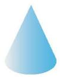 圆锥 <small>(circular cone)</small></td>
      <td width="16%" style="vertical-align: bottom;">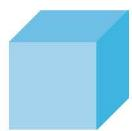 正方体 <small>(cube)</small></td>
      <td width="16%" style="vertical-align: bottom;">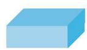 长方体 <small>(cuboid)</small></td>
      <td width="16%" style="vertical-align: bottom;">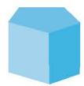 棱柱 <small>(prism)</small></td>
      <td width="16%" style="vertical-align: bottom;"> 球 <small>(sphere)</small></td>
    </tr>
  </table>
  <b style="display:block; margin-top:10px;">图 1-2 常见的几何体</b>

> [!observe] 观察·思考  
> (1) 图 1-3 中指出了六棱柱的顶点、侧棱、侧面和底面, 请你指出图中其他棱柱的顶点、侧棱、侧面和底面。  
>
> 

>   <table border="0" cellspacing="0" cellpadding="5" width="95%">
>     <tr align="center">
>       <td width="25%" style="vertical-align: bottom;">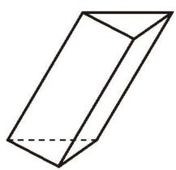 三棱柱</td>
>       <td width="25%" style="vertical-align: bottom;">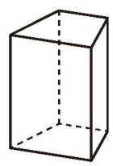 四棱柱</td>
>       <td width="25%" style="vertical-align: bottom;">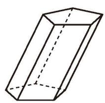 五棱柱</td>
>       <td width="25%" style="vertical-align: bottom;">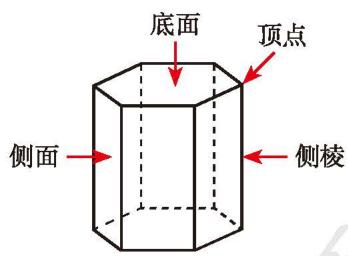 六棱柱</td>
>     </tr>
>   </table>
>   <b style="display:block; margin-top:10px;">图 1-3</b>
> 

>
> (2) 棱柱的侧棱、侧面和底面分别有什么特点?

在棱柱中，相邻两个面的交线叫作棱（edge），相邻两个侧面的交线叫作侧棱。棱柱的所有侧棱长都相等。棱柱的上、下底面的形状相同，侧面的形状都是平行四边形。

人们通常根据底面图形的边数将棱柱分为三棱柱、四棱柱、五棱柱、六棱柱……它们底面图形的形状分别为三角形、四边形、五边形、六边形……

长方体、正方体都是四棱柱。

棱柱可以分为直棱柱和斜棱柱（如图 1-4）。本书今后主要讨论直棱柱（简称棱柱）。直棱柱的侧面是长方形。

  <table border="0" cellspacing="0" cellpadding="10" width="70%">
    <tr align="center">
      <td width="50%" style="vertical-align: bottom;">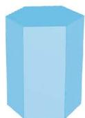 直棱柱</td>
      <td width="50%" style="vertical-align: bottom;">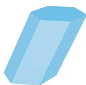 斜棱柱</td>
    </tr>
  </table>
  <b style="display:block; margin-top:10px;">图 1-4</b>

> [!think] 思考·交流
> 
> 请用自己的语言描述棱柱与圆柱的相同点与不同点，并与同伴进行交流。

> [!think] 尝试·思考
> 
> 图 1-5 中的物体都可以近似地看成由一些常见几何体组合而成，你能找出其中常见的几何体吗？你还能举出其他组合几何体的例子吗？

  <table border="0" cellspacing="0" cellpadding="5" width="90%">
    <tr align="center">
      <td width="33%" style="vertical-align: bottom;"> (1)</td>
      <td width="33%" style="vertical-align: bottom;">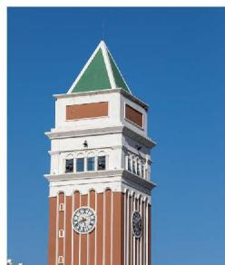 (2)</td>
      <td width="33%" style="vertical-align: bottom;"> (3)</td>
    </tr>
  </table>
  <b style="display:block; margin-top:10px;">图 1-5</b>

#### 随堂练习

1. 说一说生活中哪些物体的形状分别类似于棱柱、圆柱、圆锥与球。

2. 请完成下表。

| 棱柱      | 面的个数 | 顶点的个数 | 棱的条数 |
| :------ | :--: | :---: | :--: |
| **三棱柱** |      |       |      |
| **四棱柱** |      |       |      |

[[课本/【2024版】【北师大版】/【2024版】【北师大版】七年级上册数学/知识点/点线面视角]]
