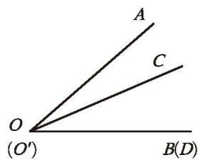
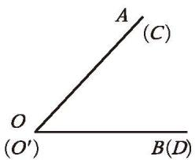
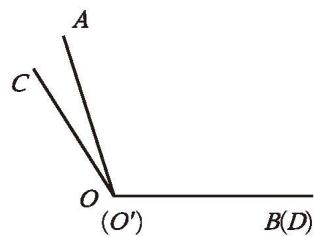
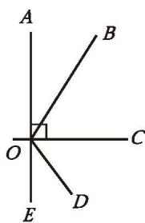
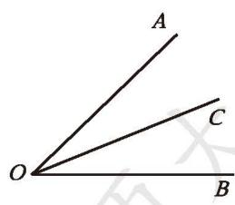
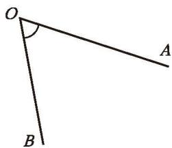
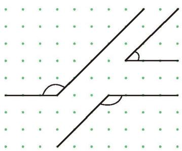
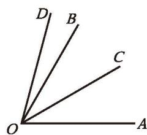

还记得怎样比较线段的长短吗？类似地，你能比较图 4-23 中每组角的大小吗？与同伴进行交流。

  

    
  

  
图 4-23

与比较线段的长短类似，如果直接观察难以判断，我们可以有两种方法对角进行比较：
1. 一种方法是用量角器量出它们的度数，再进行比较；
2. 另一种方法是将两个角的顶点及一条边重合，另一条边放在重合边的同侧比较大小（如图 4-24）。
    
    ||||
    |:-:|:-:|:-:|
    |$\angle AOB$ 大于 $\angle CO'D$|$\angle AOB$ 等于 $\angle CO'D$|$\angle AOB$ 小于 $\angle CO'D$|
    |记作 $\angle AOB > \angle CO'D$|记作 $\angle AOB = \angle CO'D$|记作 $\angle AOB < \angle CO'D$|
    |（1）|（2）|（3）|
    ||**图 4-24**||

> [!question] 尝试·思考
> 根据图 4-25，求解下列问题：  
> (1) 比较 $\angle AOB$，$\angle AOC$，$\angle AOD$，$\angle AOE$ 的大小，并指出其中的锐角、直角、钝角、平角。  
> (2) 试比较 $\angle BOC$ 和 $\angle DOE$ 的大小。  
> (3) 小亮通过折叠的方法，使 $OD$ 与 $OC$ 重合，$OE$ 落在 $\angle BOC$ 的内部，所以 $\angle BOC > \angle DOE$。你能理解这种方法吗？  
> (4) 请在图中画出小亮折叠的折痕 $OF$，$\angle DOF$ 与 $\angle COF$ 有什么大小关系？
> 
> 

>   
>    
>   
图 4-25

> 

从一个角的顶点引出的一条射线，把这个角分成两个相等的角，这条射线叫作这个角的[角平分线](课本/【2024版】【北师大版】/【2024版】【北师大版】七年级上册数学/概念/角平分线.md)（angle bisector）。

如图 4-26，射线 OC 是 $\angle AOB$ 的平分线。这时，$\angle AOC = \angle BOC = \frac{1}{2} \angle AOB$（或 $\angle AOB = 2 \angle AOC = 2 \angle BOC$）。

  
   
  图 4-26

> [!question] 操作·思考
> (1) 估计图 4-27 中 $\angle AOB$，$\angle DEF$ 的度数。  
> (2) 量一量，验证你的估计。
> 

>   

>     

>       
>     

>     

>       
>     

>   

>   
图 4-27

> 

> [!summary] 回顾·反思
>
> 回顾研究线和角的过程，你积累了哪些研究图形的经验？

> [!exercise] 随堂练习
>
> 1. 如图，在点阵中有三个角。
>
> (1) 先估计每个角的大小，再用量角器量一量；
>
> (2) 找出三个角之间的等量关系。
>
> 

>   
>    
>   （第 1 题）
> 

>
> 

>   
>    
>   （第 2 题）
> 

>
> 2. 如图，$OC$ 是 $\angle AOB$ 的平分线，$\angle BOD = \frac{1}{3} \angle COD$，$\angle BOD = 15^{\circ}$，所以 $\angle COD = \_\_\_\_$，$\angle BOC = \_\_\_\_$，$\angle AOB = \_\_\_\_$。
