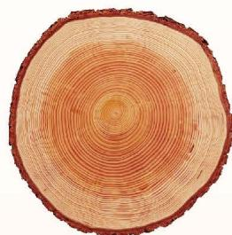

#### 阅读·欣赏 生活中的截面

锯开的树木的横断面上有一圈一圈的痕迹，这就是树木的年轮（如图 1-20）。树木的年轮蕴含着大量信息，如通过年轮的数目可以推算树木的年龄，通过年轮的宽窄可以了解历年的气候状况等。

计算机 X 射线体层成像（computed tomography, CT），是一种将 X 射线扫描摄影数据与重建数学及计算机技术结合，获得以层面信息为基础的医学影像的

  
图1-20

技术。在扫描时，不断改变投影角度来获取大量数据，经过计算机重建得到层面内每个像素的 CT 值，再由计算机实施数字—模拟转换，将 CT 值转换为相应的灰度值，最终重建为 CT 图像。扫描过程就如同数学上的“截几何体”，只不过这里的“截”并不是真正的截。实际上，这里的“几何体”是某个器官，“刀”是 X 射线。CT 的发明是医学史上具有划时代意义的一件大事，它的设计者、发明者和理论研究者因此获得 1979 年诺贝尔生理学或医学奖。

医学上的“虚拟人”是将成千上万个人体横切面的资料在计算机里进行整合、重建，形成三维立体的人体结构，为医学研究、教学与临床提供形象而真实的模型。

另外，3D打印技术也和截面密切相关。3D打印机通过读取横截面的相关信息，用液体状、粉状或片状的材料将这些截面逐层打印出来，再将各层截面以多种方式黏合起来，从而制造出一个实体。2020年5月5日，我国用长征五号B运载火箭发射的新一代载人飞船试验船上就搭载了一个复合材料空间3D打印系统，在轨飞行期间完成了我国首次太空3D打印试验。