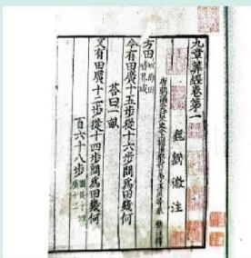
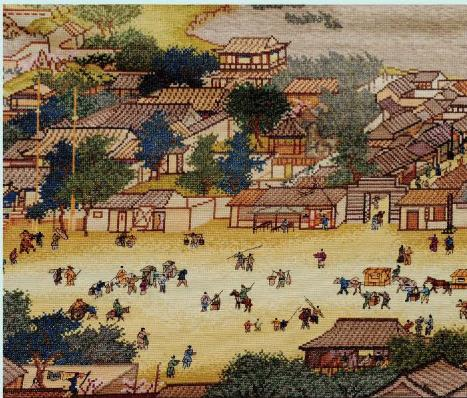

# 第五章一元一次方程

《九章算术》第七章 “盈不足” 中有这样一个问题：“今有共买物，人出八，盈三；人出七，不足四。问：人数、物价各几何？” 你知道我国古人是如何解决这个问题的吗？

本章你将经历从具体问题情境中发现等量关系、抽象出方程模型的过程，利用等式的基本性质求解一元一次方程，并运用一元一次方程解决实际问题，感受方程的模型思想和方程求解的转化思想，发展抽象能力和运算能力。

  

    

      
    

    

      
    

    

      
    

  

在本章学习过程中，你可以持续思考以下问题：

💡为什么要学习方程？方程的本质是什么？
💡如何得到一个方程？求解方程的基本思路是什么？

- [[课本/【2024版】【北师大版】/【2024版】【北师大版】七年级上册数学/知识点/1 认识方程]]
- [2 一元一次方程的解法](课本/【2024版】【北师大版】/【2024版】【北师大版】七年级上册数学/知识点/2%20一元一次方程的解法.md)
- [[课本/【2024版】【北师大版】/【2024版】【北师大版】七年级上册数学/知识点/3 一元一次方程的应用]]
- [[课本/【2024版】【北师大版】/【2024版】【北师大版】七年级上册数学/知识点/一元一次方程 回顾与思考]]
- [[课本/【2024版】【北师大版】/【2024版】【北师大版】七年级上册数学/知识点/一元一次方程 回顾与思考]]
