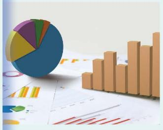

## 第六章 数据的收集与整理

你在生活中见过哪些数据和统计图？大数据时代，人们经常要和数据打交道，你知道这些数据是如何获得的吗？你能从统计图中获得哪些信息呢？

本章将带你走进丰富多彩的数据世界，你将在小学学习的基础上，进一步认识数据的意义，感悟数据蕴含着信息，经历统计活动的全过程，根据问题的需要选择适当的方式收集数据，选择合适的统计图整理和表示数据，感受数据的随机性，从数据中获取信息并作出合理的决策。

  

    

      
    

    

      
    

    

      
    

  

在本章学习过程中，你可以持续思考以下问题：

💡 在统计活动中，为什么要收集数据？
💡 利用统计图表整理和表示数据有什么好处？

- [[课本/【2024版】【北师大版】/【2024版】【北师大版】七年级上册数学/知识点/1 丰富的数据世界]]
- [[课本/【2024版】【北师大版】/【2024版】【北师大版】七年级上册数学/知识点/2 数据的收集]]
- [[课本/【2024版】【北师大版】/【2024版】【北师大版】七年级上册数学/知识点/3 数据的表示]]
- [[课本/【2024版】【北师大版】/【2024版】【北师大版】七年级上册数学/知识点/数据的收集与整理 回顾与思考]]
- [[课本/【2024版】【北师大版】/【2024版】【北师大版】七年级上册数学/习题/复习题数据的收集与整理]]
