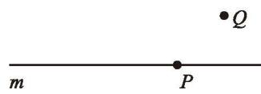
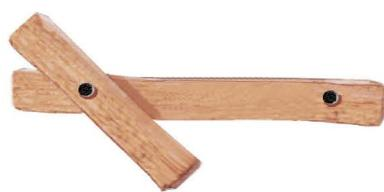
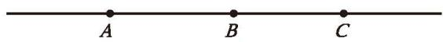

绷紧的琴弦（如图 4-1）、黑板的边沿都可以近似地看作 [[课本/【2024版】【北师大版】/【2024版】【北师大版】七年级上册数学/概念/线段]]（segment）。
将线段向一个方向无限延长就形成了 [[课本/【2024版】【北师大版】/【2024版】【北师大版】七年级上册数学/概念/射线]]（ray）。手电筒、探照灯所射出的光线（如图4-2）可以近似地看作射线。
将线段向两个方向无限延长就形成了 [[课本/【2024版】【北师大版】/【2024版】【北师大版】七年级上册数学/概念/直线]]（line）。

|  |  |
| :--------------------------------------------------------------------------------------------------------------------: | :--------------------------------------------------------------------------------------------------------------------: |
|                                                       **图 4-1**                                                        |                                                       **图 4-2**                                                        |

> [!question] 思考·交流
>
> 生活中还有哪些物体可以近似地看作线段、射线、直线？请举例说明，并与同伴进行交流。

如图 4-3、图 4-4、图 4-5，我们可以用以下方式分别表示线段、射线、直线：

> [!question] 观察·思考
> 一个点和一条直线可能会有哪些位置关系？请你画一画。
> 
> > [!summary]- 结论归纳
> > 如图 4-6，直线 $m$ 经过点 $P$，也可以说[点在直线上](课本/【2024版】【北师大版】/【2024版】【北师大版】七年级上册数学/概念/点在直线上.md)；直线 $m$ 不经过点 $Q$，也可以说[点在直线外](课本/【2024版】【北师大版】/【2024版】【北师大版】七年级上册数学/概念/点在直线外.md)。
> > 
> > 
> > **图 4-6**

> [!question] 尝试·思考
> 1. 过一点 $A$ 可以画几条直线？  
> 2. 过两点 $A, B$ 可以画几条直线？  
> 3. 如果你想将一根细木条固定在墙上（如图 4-7），至少需要几个钉子？
> 
> 
> **图 4-7**
> 
> > [!summary]- 结论归纳
> > 根据生活经验，我们发现：
> > 
> > 这一事实可以简述为：[两点确定一条直线 1](课本/【2024版】【北师大版】/【2024版】【北师大版】七年级上册数学/概念/两点确定一条直线%201.md)。

#### 随堂练习

1. 举出一个能反映“经过两点有且只有一条直线”的实例。

2. 指出下图中的直线、射线、线段，并分别写出3条射线和3条线段。

  
   
  (第2题)

