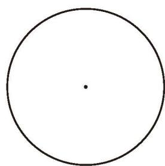
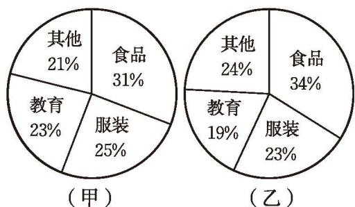

书籍是人类进步的阶梯，阅读能使人不断进步。为办好学校阅读周的活动，校图书馆计划购买 200 册图书，奖励在阅读周各项活动中表现优异的学生。图书馆张老师想了解现在同学们更喜欢读什么类型的图书，以便购买的图书受同学们欢迎。于是他设计了如下调查问卷，在全校随机选取了 120 名同学进行调查。

> [!todo] 📝 调查问卷
> 
> **你最喜欢阅读的图书类型是什么？（单选）**
> 
> | | |
> | :--- | :--- |
> | <input type="checkbox"> A. 文学 | <input type="checkbox"> B. 历史 |
> | <input type="checkbox"> C. 科普 | <input type="checkbox"> D. 军事 |
> | <input type="checkbox"> E. 艺术 | <input type="checkbox"> F. 其他 |

调查结果见下表：
<table><tr><td>最喜欢阅读的图书类型</td><td>文学</td><td>历史</td><td>科普</td><td>军事</td><td>艺术</td><td>其他</td></tr><tr><td>人数</td><td>36</td><td>24</td><td>27</td><td>12</td><td>12</td><td>9</td></tr></table>

(1) 如果让你协助张老师买书，你会提出什么购买建议？你是如何考虑的？
(2) 喜欢文学类图书的人数占调查总人数的百分比是多少？喜欢历史、科普、军事、艺术、其他类型图书的人数占调查总人数的百分比分别是多少？上述所有百分比之和是多少？
(3) 你能尝试用扇形统计图表示上述结果吗？

>[!tip] 在扇形统计图中，每部分占总体的百分比等于该部分所对应的扇形圆心角的度数与 $360^{\circ}$ 的比。

> [!question] 操作·思考
> 根据上述张老师的调查数据，按如下方法绘制扇形统计图。
> 
> (1) 计算各选项人数占调查总人数的百分比，并填在下表中。  
> (2) 计算各个扇形圆心角的度数，并填在下表中。其中，圆心角度数 $= 360^{\circ} \times$ 该项所占的百分比。
> 
> | 最喜欢阅读的图书类型 | 文学 | 历史 | 科普 | 军事 | 艺术 | 其他 |
> | :---: | :---: | :---: | :---: | :---: | :---: | :---: |
> | **百分比** | | | | | | |
> | **对应的圆心角度数** | | | | | | |
> 
> (3) 在图 6-7 的圆中画出各个扇形，并标上百分比。
> 
> 

>   
>    
>   
图 6-7

> 

💡**扇形统计图**可以直观地反映各部分在总体中所占的比例。

> [!question] 观察·思考
> 观察图 6-8，回答下列问题：
> 
> (1) 如果用整个圆表示总体，那么哪个扇形表示总体的 $25\%$？  
> (2) 如果用整个圆表示你们班的人数，那么扇形 B 大约表示多少人？
> 
> 

>   
> 

> 
> (3) 如果用整个圆表示 $9\text{ hm}^2$ 稻田，那么扇形 C 表示多少公顷稻田？
> 
> 

>   
图 6-8

> 

> [!question] 思考·交流
> 图 6-9 是甲、乙两家庭全年支出费用的扇形统计图。根据统计图，小刚认为就全年食品支出费用来说，乙家庭比甲家庭多，你同意他的看法吗？为什么？与同伴进行交流。
> 
> 

>   
>    
>   
图 6-9

> 

> 
> > [!success]- 解析与答案
> > **不同意小刚的看法。**
> > 
> > **原因分析：**
> > * **扇形统计图的局限性：** 扇形统计图只能直观地反映各部分支出在全年总支出中所占的**百分比（比例）**，而不能直接反映具体的**数量（金额）**。
> > * **缺少总基数：** 我们在图中只看到了乙家庭食品支出的百分比高于甲家庭，但由于**甲、乙两家庭全年的总支出费用（总基数）未知**，所以无法通过“总支出 $\times$ 百分比”来计算和比较各自食品支出的具体金额。
> > * **举例说明：** 如果甲家庭全年总支出为 10 万元，食品支出占 $30\%$，则为 3 万元；而乙家庭全年总支出只有 5 万元，食品支出占 $40\%$，也才 2 万元。此时反而是甲家庭比乙家庭多。因此，在不知道总费用的情况下，无法进行具体的数量比较。

> [!question] 尝试·思考
>
> 小亮对全班 40 名学生进行了"你对哪些课程非常感兴趣"的调查，获得如下数据：语文 20 人，数学 25 人，英语 18 人，生物学 10 人，信息科技 34 人，其他 12 人。他想用扇形统计图表示这些数据，却发现 6 项的百分比之和大于 1，为什么会这样呢？

> [!exercise] 随堂练习
> **1. 根据下表绘制扇形统计图，表示各大洋面积占四大洋总面积的百分比。**
> 
> 

>   <strong>四大洋的面积统计表</strong>
> 

> 
> | 海洋名 | 面积（万 $\text{km}^2$） |
> | :---: | :---: |
> | 太平洋 | 17 967.9 |
> | 大西洋 | 9 336.3 |
> | 印度洋 | 7 492.0 |
> | 北冰洋 | 1 475.0 |
> 
> > [!success]- 解析与计算步骤
> > #### 第一步：计算四大洋总面积
> > $$\text{总面积} = 17967.9 + 9336.3 + 7492.0 + 1475.0 = 36271.2 \text{（万 km}^2\text{）}$$
> > 
> > #### 第二步：计算各大洋所占百分比与对应圆心角度数
> > 根据公式：
> > * $\text{百分比} = \frac{\text{该大洋面积}}{\text{总面积}} \times 100\%$
> > * $\text{圆心角度数} = 360^{\circ} \times \text{该项所占的百分比}$
> > 
> > 经计算（结果四舍五入保留一位小数），数据补充如下表：
> > 
> | 海洋名 | 面积（万 $\text{km}^2$） | 百分比（%） | 对应的圆心角度数 |
> | :---: | :---: | :---: | :---: |
> | **太平洋** | 17 967.9 | $49.5\%$ | $178.4^{\circ}$ |
> | **大西洋** | 9 336.3 | $25.7\%$ | $92.7^{\circ}$ |
> | **印度洋** | 7 492.0 | $20.7\%$ | $74.4^{\circ}$ |
> | **北冰洋** | 1 475.0 | $4.1\%$ | $14.5^{\circ}$ |
> | **合计** | **36 271.2** | **100%** | **360°** |
> > 
> > #### 第三步：作图提示
> > 1. 用圆规画一个适当大小的圆。
> > 2. 使用量角器根据上述“对应的圆心角度数”在圆中依次画出四个扇形。
> > 3. 在各个扇形内标明大洋名称及其对应的百分比。