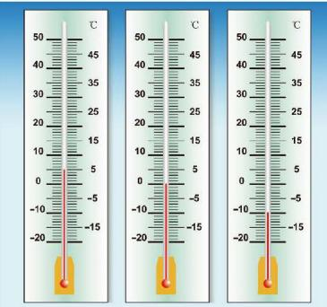
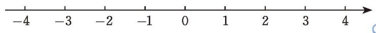
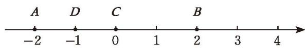
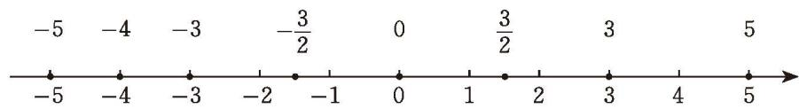

在一条水平直线上取一点（称为[[课本/【2024版】【北师大版】/【2024版】【北师大版】七年级上册数学/概念/原点]]）表示 0，选取某一长度作为[[课本/【2024版】【北师大版】/【2024版】【北师大版】七年级上册数学/概念/单位长度]]，规定这条直线上向右的方向为[[课本/【2024版】【北师大版】/【2024版】【北师大版】七年级上册数学/概念/正方向]]，那么相反方向就是负方向。原点右边的点可以表示正数，原点左边的点可以表示负数。这样，所有有理数就都可以用直线上的点表示了。

  
   
  图 2-3

像这样，规定了原点（origin）、单位长度（unit length）和正方向（positive direction）的直线称为[[课本/【2024版】【北师大版】/【2024版】【北师大版】七年级上册数学/概念/数轴]]（number line）。如图 2-4，通常将数轴画成水平直线，并选择向右的方向为正方向。

  
   
  图 2-4

像一个平放的温度计。

在这条数轴上，+3 可以用位于原点右边 3 个单位长度的点表示，-4 可以用位于原点左边 4 个单位长度的点表示。

> [!think] 尝试·思考
> $\frac{1}{4}$ 用数轴上的哪个点表示？-1.5 呢？其他数呢？
>> [!tip] 任何一个有理数都可以用数轴上的一个点来表示。

> [!example]- **例 4**
> 1. 如图 2-5，数轴上点 $A$，$B$，$C$，$D$ 分别表示什么数？
>
> 

>   
>    
>   图 2-5
> 

>
> 2. 画出数轴，并用数轴上的点表示下列各数：
>
> $$
> \frac{3}{2}, -3, 0, 5, -4, -\frac{3}{2}, 3, -5.
> $$
>
> > [!abstract]- 解
> > 1. 点 $A$ 表示 -2，点 $B$ 表示 2，点 $C$ 表示 0，点 $D$ 表示 -1。
> > 2. 如图 2-6 所示。
> >
> > 

> >   
> >    
> >   图 2-6
> > 

> [!observe] 观察·思考
> 观察图 2-6 中表示 3 与 -3 的两个点，它们在数轴上的位置有什么关系？表示 $\frac{3}{2}$ 与 $-\frac{3}{2}$ 的两个点呢？表示 5 与 -5 的两个点呢？
> 
> 在数轴上，表示互为相反数的两个点，位于原点的两侧，且到原点的距离相等。
>> [!tip]  一个数的绝对值就是这个数所对应的点到原点的距离。

> [!think] 思考·交流
> 将例 4（2）中的各数按照从小到大的顺序排列，并用 “<” 连接起来；观察它们在数轴上对应点的位置（如图 2-6），你有什么发现？与同伴进行交流。

#### 随堂练习

1. 画出数轴，用数轴上的点表示下列各数，并用 “>” 将它们连接起来：

$$
3, -2, 1.5, -\frac{3}{4}, 0, -0.5.
$$

2. 在数轴上距离原点 2 个单位长度的点表示什么数？

3. 在数轴上表示下列各数及其相反数，并求出它们的绝对值：

$$
-4\frac{3}{5}, 6, -7.
$$
