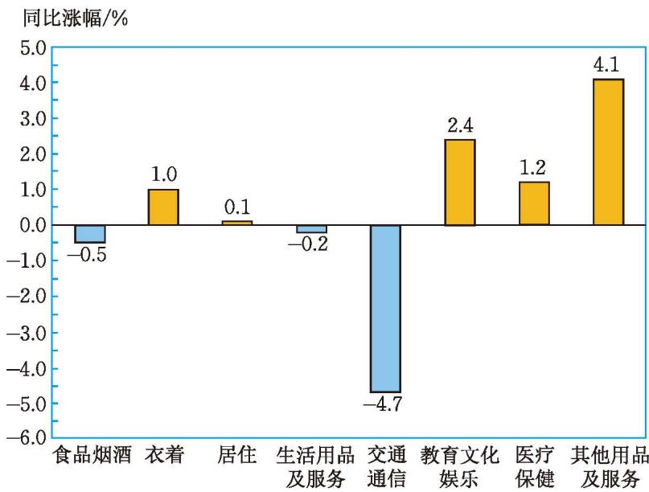

## 1 认识有理数

某班举行知识竞赛，评分标准是：答对 1 题加 1 分，答错 1 题扣 1 分，不回答得 0 分；每个参赛队的基本分均为 0 分。下表是用图 2-1 所示的表情表示的两个参赛队的答题情况。

   
  图 2-1

<table>
  <tr>
    <th align="center">参赛队</th>
    <th align="center">答题情况</th>
  </tr>
  <tr>
    <td align="center">第一队</td>
    <td align="center"></td>
  </tr>
  <tr>
    <td align="center">第二队</td>
    <td align="center"></td>
  </tr>
</table>

1. 你能用适当的方式表示每个队答题得分的情况吗？试完成下表。

<table>
  <tr>
    <td align="center">参赛队</td>
    <td align="center">答对题的得分</td>
    <td align="center">答错题的得分</td>
    <td align="center">不回答题的得分</td>
  </tr>
  <tr>
    <td align="center">第一队</td>
    <td></td>
    <td></td>
    <td></td>
  </tr>
  <tr>
    <td align="center">第二队</td>
    <td></td>
    <td></td>
    <td></td>
  </tr>
</table>

2. 如果用 “+1” 表示答对 1 题的得分，用 “-1” 表示答错 1 题的得分，那么你如何填写上表？

> [!tip] 尝试·交流
> 1. 下表是 2023 年 1 月 1 日四个城市的气温情况。你能说出表中各数的实际意义吗？
>
> <table>
>   <tr>
>     <td align="center">城市</td>
>     <td align="center">北京</td>
>     <td align="center">昆明</td>
>     <td align="center">西安</td>
>     <td align="center">哈尔滨</td>
>   </tr>
>   <tr>
>     <td align="center">气温</td>
>     <td align="center">-7°C~5°C</td>
>     <td align="center">7°C~13°C</td>
>     <td align="center">-2°C~2°C</td>
>     <td align="center">-19°C~-14°C</td>
>   </tr>
> </table>
>
> 2. 珠穆朗玛峰的海拔大约是 $8848.86 \mathrm{~m}$，吐鲁番盆地最低处的海拔大约是 $-154.31 \mathrm{~m}$。$8848.86 \mathrm{~m}$，$-154.31 \mathrm{~m}$ 的实际意义分别是什么？
>
> 3. 图 2-2 展示了 2023 年 7 月我国居民消费价格分类别同比涨幅情况。请你说一说 $-0.5\%$，$2.4\%$ 等数的实际意义，并与同伴进行交流。
>
> 

>   
>    
>   图 2-2
> 

“加分与扣分”“零上温度与零下温度”“高于海平面与低于海平面”“上涨量与下跌量”等都是具有相反意义的量。为了表示具有相反意义的量，我们可以把其中一个量规定为正的，把与这个量意义相反的量规定为负的，并分别用 “+”“-” 来表示。例如，“加 3 分”记为 +3 分，“扣 2 分”就记为 -2 分。

像 +3，+15，+2.4%，… 都是[正数](课本/【2024版】【北师大版】/【2024版】【北师大版】七年级上册数学/概念/正数.md)，正数前面的 “+” 可以省略不写。

像 -2，-8，-0.5%，… 都是[负数](课本/【2024版】【北师大版】/【2024版】【北师大版】七年级上册数学/概念/负数.md)。

0 既不是正数，也不是负数。

负数与对应的正数在数量上相等，表示的意义相反。

> [!example]- **例 1**
> 1. 某人转动转盘，如果用 +5 圈表示沿逆时针方向转了 5 圈，那么沿顺时针方向转了 12 圈怎样表示？
> 2. 在某次乒乓球质量检测中，如果一个乒乓球的质量高于标准质量 $0.02 \mathrm{~g}$ 记作 $+0.02 \mathrm{~g}$，那么 $-0.03 \mathrm{~g}$ 表示什么？
> 3. 某大米包装袋上标注着“净含量：$10 \mathrm{~kg} \pm 50 \mathrm{~g}$”，这里的 “$10 \mathrm{~kg} \pm 50 \mathrm{~g}$” 表示什么？
>
> > [!abstract]- 解
> > 1. 沿顺时针方向转了 12 圈记作 -12 圈。
> > 2. $-0.03 \mathrm{~g}$ 表示乒乓球的质量低于标准质量 $0.03 \mathrm{~g}$。
> > 3. 每袋大米的标准质量应为 $10 \mathrm{~kg}$，但实际每袋大米可能有 $50 \mathrm{~g}$ 的误差，即每袋大米的净含量最多是 $10 \mathrm{~kg} + 50 \mathrm{~g}$，最少是 $10 \mathrm{~kg} - 50 \mathrm{~g}$。

> [!think] 思考·交流
> 4. 选定一个身体高度作为标准，用正数、负数或 0 表示你们班每名同学的身高与选定的身高标准的差。你是怎样表示的？从你的表示能看出谁最高吗？
> 5. 你能将所学的数进行分类吗？与同伴进行交流。

整数（integer） $\left\{\begin{array}{l}\text {正整数：如 }1,2,3,\cdots\\ \text {零：0}\\ \text {负整数：如 }-1,-2,-3,\cdots\end{array}\right.$ 
分数（fraction） $\left\{\begin{array}{l}\text {正分数：如 }\frac{1}{2},\frac{1}{3},5.2,\cdots\\ \text {负分数：如 }-\frac{1}{5},-3.5,-\frac{5}{6},\cdots\end{array}\right.$
整数与分数统称[有理数](课本/【2024版】【北师大版】/【2024版】【北师大版】七年级上册数学/概念/有理数.md)（rational number）。

#### 随堂练习

1. 完成下列问题。
   2. 如果零上 $5^{\circ} \mathrm{C}$ 记作 $+5^{\circ} \mathrm{C}$，那么零下 $3^{\circ} \mathrm{C}$ 记作什么？
   3. 东、西为两个相反方向，如果 $-4 \mathrm{~m}$ 表示一个物体向西运动 $4 \mathrm{~m}$，那么 $+2 \mathrm{~m}$ 表示什么？物体原地不动记作什么？
   4. 某仓库运进面粉 7.5 t 记作 +7.5 t，那么运出面粉 3.8 t 记作什么？

5. 所有的正数组成正数集合，所有的负数组成负数集合，所有的整数组成整数集合，所有的分数组成分数集合。请把下列各数填入相应的集合中：

$$
3, -7, -\frac{2}{3}, 5.\dot{6}, 0, -8\frac{1}{4}, 15, \frac{1}{9}.
$$

正数集合：$\{ \cdots \}$

负数集合：$\{ \cdots \}$

整数集合：$\{ \cdots \}$

分数集合：$\{ \cdots \}$
