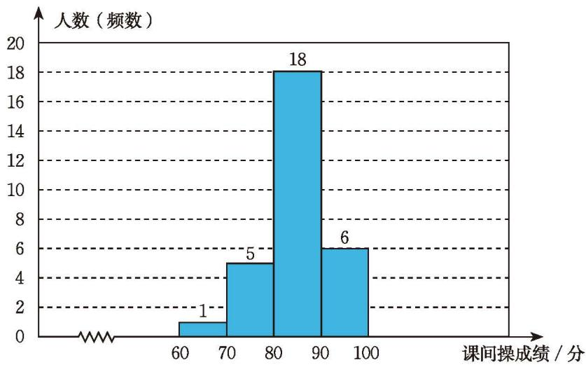

表 6-2 是本章第 1 节七（1）班学生的部分数据信息。

表 6-2 七（1）班全班学生部分数据表
<table><tr><td>学号</td><td>性别</td><td>肺活量/mL</td><td>立定跳远成绩/cm</td><td>课间操成绩/分</td><td>美术成绩</td><td>学号</td><td>性别</td><td>肺活量/mL</td><td>立定跳远成绩/cm</td><td>课间操成绩/分</td><td>美术成绩</td></tr><tr><td>1</td><td>男</td><td>2 926</td><td>180</td><td>81</td><td>优</td><td>8</td><td>男</td><td>4 480</td><td>211</td><td>79</td><td>优</td></tr><tr><td>2</td><td>男</td><td>2 234</td><td>154</td><td>78</td><td>良</td><td>9</td><td>男</td><td>3 617</td><td>160</td><td>72</td><td>中</td></tr><tr><td>3</td><td>女</td><td>2 540</td><td>165</td><td>86</td><td>优</td><td>10</td><td>女</td><td>3 240</td><td>143</td><td>86</td><td>优</td></tr><tr><td>4</td><td>男</td><td>3 720</td><td>172</td><td>81</td><td>中</td><td>11</td><td>男</td><td>3 377</td><td>205</td><td>91</td><td>优</td></tr><tr><td>5</td><td>男</td><td>3 212</td><td>183</td><td>94</td><td>优</td><td>12</td><td>男</td><td>2 312</td><td>175</td><td>80</td><td>良</td></tr><tr><td>6</td><td>男</td><td>2 361</td><td>165</td><td>83</td><td>良</td><td>13</td><td>女</td><td>2 843</td><td>148</td><td>85</td><td>优</td></tr><tr><td>7</td><td>女</td><td>2 397</td><td>135</td><td>88</td><td>优</td><td>14</td><td>男</td><td>2 984</td><td>207</td><td>90</td><td>优</td></tr><tr><td>15</td><td>女</td><td>2 077</td><td>145</td><td>91</td><td>优</td><td>23</td><td>女</td><td>3 024</td><td>165</td><td>87</td><td>优</td></tr><tr><td>16</td><td>男</td><td>2 829</td><td>188</td><td>83</td><td>优</td><td>24</td><td>女</td><td>3 189</td><td>189</td><td>82</td><td>优</td></tr><tr><td>17</td><td>男</td><td>3 346</td><td>198</td><td>86</td><td>优</td><td>25</td><td>女</td><td>2 511</td><td>165</td><td>68</td><td>中</td></tr><tr><td>18</td><td>女</td><td>2 504</td><td>177</td><td>92</td><td>优</td><td>26</td><td>女</td><td>2 646</td><td>152</td><td>88</td><td>优</td></tr><tr><td>19</td><td>女</td><td>3 240</td><td>157</td><td>83</td><td>优</td><td>27</td><td>女</td><td>2 385</td><td>150</td><td>80</td><td>优</td></tr><tr><td>20</td><td>男</td><td>2 939</td><td>157</td><td>75</td><td>良</td><td>28</td><td>男</td><td>4 328</td><td>200</td><td>80</td><td>优</td></tr></table>

(1) 你能用恰当的统计图表表示该班学生的美术成绩吗？从你的图表中能看出大部分学生处于哪个等级吗？成绩的整体分布情况怎样？
(2) 你能用恰当的统计图表表示该班学生的课间操成绩吗？从你的图表中能看出大部分学生处于哪个分数段吗？分数的整体分布情况怎样？

对于（1），可以采用表格的形式，也可以采用条形统计图的形式（如图 6-10）。

<table><tr><td>美术成绩</td><td>优</td><td>良</td><td>中</td></tr><tr><td>人数（频数）[^1]</td><td>22</td><td>5</td><td>3</td></tr></table>

  
   
  图 6-10

对于（2），可以借鉴美术成绩的表示，将课间操成绩每 10 分为一段分组，统计每个分数段的学生人数，得到下面的表格和统计图（如图 6-11）。

<table><tr><td>课间操成绩/分</td><td>60~70</td><td>70~80</td><td>80~90</td><td>90~100</td></tr><tr><td>人数（频数）</td><td>1</td><td>5</td><td>18</td><td>6</td></tr></table>

  
   
  图 6-11

你能明白这种统计图的画法吗？

像图 6-11 这样的统计图称为[[课本/【2024版】【北师大版】/【2024版】【北师大版】七年级上册数学/知识点/频数直方图]]。当遇到大量的数据或数据连续取值时，我们通常先将数据适当分组，然后绘制频数直方图直观地反映数据的整体分布状况。

例 水资源问题是全球关注的热点。为避免水资源浪费，某市政府计划对居民家庭生活用水情况进行调查。为此，相关部门在该市通过随机抽样，获得了 60 户居民的月均生活用水量（单位：$\mathrm{m}^{3}$）数据：

<table><tr><td>8.6</td><td>14.8</td><td>10.5</td><td>6.9</td><td>5.4</td><td>9.6</td><td>5.3</td><td>5.8</td><td>11.4</td><td>4.7</td></tr><tr><td>10.3</td><td>12.4</td><td>7.9</td><td>13.5</td><td>22.5</td><td>7.2</td><td>25.4</td><td>18.6</td><td>2.2</td><td>11.9</td></tr><tr><td>22.0</td><td>5.3</td><td>23.4</td><td>3.6</td><td>8.5</td><td>5.2</td><td>6.2</td><td>4.6</td><td>5.6</td><td>12.8</td></tr><tr><td>26.8</td><td>10.5</td><td>2.4</td><td>8.9</td><td>7.3</td><td>8.0</td><td>16.0</td><td>4.9</td><td>2.7</td><td>3.0</td></tr><tr><td>5.7</td><td>16.2</td><td>6.6</td><td>13.8</td><td>17.6</td><td>4.2</td><td>3.1</td><td>10.7</td><td>21.6</td><td>9.4</td></tr><tr><td>7.8</td><td>8.6</td><td>13.2</td><td>9.5</td><td>4.6</td><td>2.3</td><td>5.7</td><td>11.1</td><td>14.2</td><td>10.0</td></tr></table>

将数据适当分组，并绘制相应的频数直方图反映该市居民月均生活用水量的整体状况。

> [!success]- 解
>
> (1) 确定所给数据中的最大值和最小值：上述数据中最大值是 26.8，最小值是 2.2。
>
> (2) 将数据适当分组：最大值和最小值相差 $26.8 - 2.2 = 24.6$，组数太多或太少，都会影响对数据整体状况的了解。考虑以 $4 \mathrm{~m}^{3}$ 为组距（每组两个端点之间的距离称为组距），$24.6 \div 4 = 6.15$，可以考虑分成 7 组。
>
> (3) 统计每组中数据出现的次数：
>
> <table><tr><td>分组</td><td>家庭数（频数）</td><td>分组</td><td>家庭数（频数）</td></tr><tr><td>2.0~6.0</td><td>20</td><td>18.0~22.0</td><td>2</td></tr><tr><td>6.0~10.0</td><td>15</td><td>22.0~26.0</td><td>4</td></tr><tr><td>10.0~14.0</td><td>13</td><td>26.0~30.0</td><td>1</td></tr><tr><td>14.0~18.0</td><td>5</td><td></td><td></td></tr></table>
>
> (4) 绘制频数直方图（如图 6-12）：

  
   
  图 6-12

> [!question] 思考·交流
>
> 你认为频数直方图有什么特点？与条形统计图相比有哪些不同？与同伴进行交流。

> [!exercise] 随堂练习
>
> 1. 请将表 6-2 中学生的课间操成绩以 5 分为组距分段，并用频数直方图表示。
