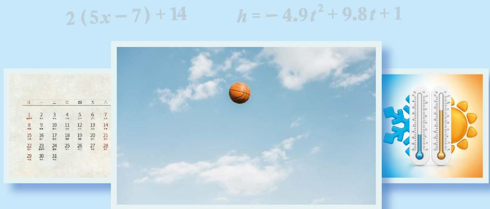

# 第三章整式及其加减

#### 整式及其加减

随便想一个自然数，将这个数乘 5 减 7，再把结果乘 2 加 14，无论开始想的自然数是什么，按照上面方法计算，得到的数的个位数字一定是 0。你相信吗？不妨试试看！

在小学，我们已经探索过用字母表示事物的关系、性质和规律的方法。本章将进一步理解字母表示数的意义，分析具体问题中的简单数量关系并用代数式表示，理解整式的概念和整式加减运算的意义，进行整式的加减运算。你将进一步体会字母可以像数一样进行运算和推理，得到的结论具有一般性，并在这一过程中提高抽象能力、运算能力和推理能力等。

在本章学习过程中，你可以持续思考以下问题：
💡为什么要用字母或含有字母的式子表示数和数量关系？
💡含有字母的运算与数的运算有什么联系和区别？

- [[1 代数式]]
- [[2 整式的加减]]
- [[3 探索与表达规律]]
- [[整式及其加减 回顾与思考]]
- [[整式及其加减 复习题]]
