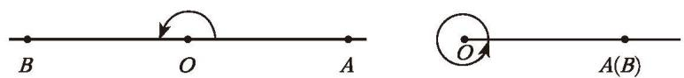
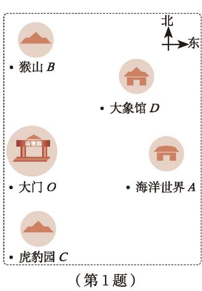

在小学我们学习过角，请说说你对角的认识。你能在图 4-16 中找到角吗？

  

    

      
    

    

      
    

    

      
    

  

  
图 4-16

[角](课本/【2024版】【北师大版】/【2024版】【北师大版】七年级上册数学/概念/角.md)（angle）由两条具有公共端点的射线组成（如图 4-17），也可以看成是由一条射线绕着它的端点旋转而成的（如图 4-18）。

<table border="0" cellspacing="0" cellpadding="5" width="80%">
  <tr align="center">
    <td width="50%" style="vertical-align: bottom;"> <small>图 4-17</small></td>
    <td width="50%" style="vertical-align: bottom;"> <small>图 4-18</small></td>
  </tr>
</table>

> [!warning] 注意
> 角的大小与边的长短无关。

如图 4-19，一条射线绕它的端点旋转，当终边和始边成一条直线时，所成的角叫作[平角](课本/【2024版】【北师大版】/【2024版】【北师大版】七年级上册数学/概念/平角.md)（straight angle）。终边继续旋转，当它又和始边重合时，所成的角叫作[周角](课本/【2024版】【北师大版】/【2024版】【北师大版】七年级上册数学/概念/周角.md)（round angle）。

  
   
  图 4-19

如图 4-20，通常可以用以下方式表示角：

<table border="0" cellspacing="0" cellpadding="5" >
  <tr align="center">
    <td width="33%" style="vertical-align: bottom;"> <small>(1)</small></td>
    <td width="34%" style="vertical-align: bottom;"> <small>(2)</small></td>
    <td width="33%" style="vertical-align: bottom;"> <small>(3)</small></td>
  </tr>
</table>
<b style="display:block; margin-top:10px; color: var(--text-muted, #666);">图 4-20</b>

> [!question] 尝试·思考
> (1) 用适当的方法表示图 4-21 中的每个角。  
> (2) 图 4-21 中的 $\angle BAC$，$\angle CAD$，$\angle BAD$ 能用 $\angle A$ 来表示吗？
> 
> 

>   
>    
>   <small style="color: var(--text-muted, #666);">图 4-21</small>
> 

和线段一样，在学习了角的表示方法后，我们也要学习如何度量角的大小。在小学我们已经知道：
$$
1 \text{ 周角} = 360^{\circ}, \quad 1 \text{ 平角} = 180^{\circ}, \quad 1 \text{ 直角} = 90^{\circ}.
$$

为了更精密地度量角，我们规定：
>[!tip] 
1∘ 的 $\frac{1}{60}$ 为1分，记作 1′ ，即 1∘ = 60′ 。
1′ 的 $\frac{1}{60}$ 为1秒，记作 1′′ ，即 1′ = 60′′ 。

> [!example]- 例 1
> 计算：  
> (1) $1.45^{\circ}$ 等于多少分？等于多少秒？  
> (2) $1800''$ 等于多少分？等于多少度？
> 
> > [!todo]- 解
> > (1) 由 $1^{\circ} = 60'$，得 $1.45^{\circ} = 60' \times 1.45 = 87'$；  
> > 由 $1' = 60''$，得 $87' = 60'' \times 87 = 5220''$。  
> > 所以 $1.45^{\circ} = 87' = 5220''$。  
> > 
> > (2) 由 $1' = 60''$，得 $1'' = \left(\frac{1}{60}\right)'$，所以 $1800'' = \left(\frac{1}{60}\right)' \times 1800 = 30'$；  
> > 由 $1^{\circ} = 60'$，得 $1' = \left(\frac{1}{60}\right)^{\circ}$，所以 $30' = \left(\frac{1}{60}\right)^{\circ} \times 30 = 0.5^{\circ}$。  
> > 所以 $1800'' = 30' = 0.5^{\circ}$。

> [!question] 观察·思考
> 图 4-22 呈现了几个城市在中国地图上的大致位置。  
> (1) 分别表示以北京为中心的每两个城市之间的夹角。  
> (2) 哈尔滨在北京的北偏东大约多少度？
> 
> 

>   
>    
>   <small style="color: var(--text-muted, #666);">图 4-22</small>
> 

> [!exercise] 随堂练习
>
> 1. 一个动物园的部分示意图如图所示。
>
> (1) 海洋世界在大门的正东方向，你能说出它在大门的北偏东多少度吗？
>
> (2) 虎豹园、猴山、大象馆分别在大门的北偏东（或南偏东）多少度？
>
> (3) 在图中连接各个景点与大门，并用适当的方式表示各角。
>
> (4) 指出图中的锐角、钝角、直角、平角。
>
> 

>   
> 

>
> 1. (1) $0.25^{\circ}$ 等于多少分？等于多少秒？
>    (2) $2700''$ 等于多少分？等于多少度？
