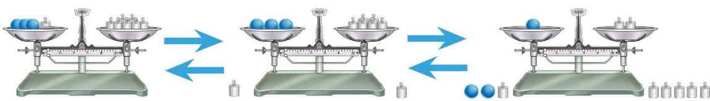
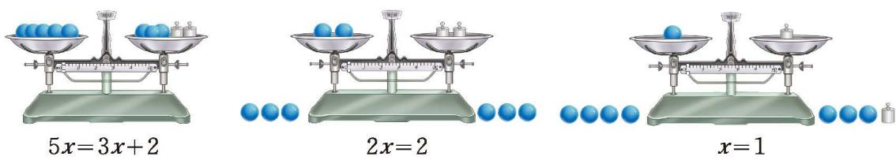

方程是含有未知数的等式，解方程自然要研究等式的基本性质。等式有哪些基本性质呢？

我们不难理解下面两个基本事实：

(1) 如果 a = b，那么 b = a；

(2) 如果 a = b，b = c，那么 a = c。

除此之外，等式还有哪些基本性质呢？

> [!question] 思考·交流
> (1) 等式的两边都加（减）、乘（除以）同一个数，等式还成立吗？  
> (2) 你能借助图 5-1 的天平解释自己的发现吗？与同伴进行交流。
> 
> 

>   
>    
>   
图 5-1

> 

> 
> > [!summary]- [等式的基本性质](课本/【2024版】【北师大版】/【2024版】【北师大版】七年级上册数学/概念/等式的基本性质.md)
> > 等式的两边都加（或减）同一个代数式，所得结果仍是等式。
> > 等式的两边都乘同一个数（或除以同一个不为 0 的数），所得结果仍是等式。
> > 
> > 用字母可以表示为：
> > 1. 如果 $a = b$，那么 $a \pm c = b \pm c$。
> > 2. 如果 $a = b$，那么 $ac = bc$（或当 $c \neq 0$ 时，$\frac{a}{c} = \frac{b}{c}$）。

> [!question] 尝试·思考
> (1) 如图 5-2，小明用天平解释了方程 $5x = 3x + 2$ 的变形过程，你能明白他的意思吗？
> 
> 

>   
>    
>   
图 5-2

> 

> 
> (2) 请用等式的基本性质解释方程 $5x = 3x + 2$ 的上述变形过程。
> 
> > [!success]- 解析与补充
> > **天平含义与等式变形：**
> > * **图 5-2 (1) 左图：** 天平左盘有 5 个未知数球 $x$，右盘有 3 个未知数球 $x$ 和 2 个 1 克砝码。此时天平平衡，对应方程：
> >   $$5x = 3x + 2$$
> > * **图 5-2 (1) 右图：** 观察发现，小明从天平的**两盘同时拿走了 3 个未知数球 $x$**，天平依然保持平衡。
> > 
> > **用等式的基本性质解释：**
> > 根据**等式的基本性质 1**（等式两边都减去同一个数或同一个整式，等式还成立），在方程 $5x = 3x + 2$ 的左右两边同时减去 $3x$：
> > $$5x - 3x = 3x + 2 - 3x$$
> > 合并同类项后，方程化简为：
> > $$2x = 2$$
> > 
> > 再根据**等式的基本性质 2**（等式两边都除以同一个不为 0 的数，等式还成立），在方程两边同时除以 2：
> > $$\frac{2x}{2} = \frac{2}{2}$$
> > 最终求得方程的解为：
> > $$x = 1$$

> [!example]- 例1 解方程：
> (1) $x + 2 = 5$；
> (2) $3 = x - 5$。
>
> > [!success]- 解
> >
> > (1) 方程的两边都减 2，得
> >
> > $$
> > x + 2 - 2 = 5 - 2.
> > $$
> >
> > 于是
> >
> > $$
> > x = 3.
> > $$
> >
> > (2) 方程的两边都加 5，得
> >
> > $$
> > 3 + 5 = x - 5 + 5.
> > $$
> >
> > 解方程是逐步把方程转化为 $x = a$ 的形式。于是
> >
> > $$
> > 8 = x.
> > $$
> >
> > 习惯上，我们写成 $x = 8$。

>[!tip] [检验解方程是否正确](课本/【2024版】【北师大版】/【2024版】【北师大版】七年级上册数学/检验解方程是否正确.md)
把求出的解代入原方程，可以检验解方程是否正确。例如，把 $x = 3$ 代入方程 $x + 2 = 5$，左边 $= 3 + 2 = 5$，右边 $= 5$，左边 $=$ 右边，所以 $x = 3$ 是方程 $x + 2 = 5$ 的解。

> [!example]- 例2 解方程：
> (1) $-3x = 15$；
> (2) $-\frac{n}{3} - 2 = 10$。
>
> > [!success]- 解
> >
> > (1) 方程的两边都除以 $-3$，得
> >
> > $$
> > \frac{-3x}{-3} = \frac{15}{-3},
> > $$
> >
> > 即
> >
> > $$
> > x = -5.
> > $$
> >
> > (2) 方程的两边都加 2，得
> >
> > $$
> > -\frac{n}{3} - 2 + 2 = 10 + 2.
> > $$
> >
> > 合并同类项，得
> >
> > $$
> > -\frac{n}{3} = 12.
> > $$
> >
> > 方程的两边都乘 $-3$，得
> >
> > $$
> > n = -36.
> > $$

> [!exercise] 随堂练习
>
> 1. 解方程：
>
> (1) $x - 9 = 8$；
>
> (2) $5 - y = -16$；
>
> (3) $3x + 4 = -13$；
>
> (4) $\frac{2}{3} x - 1 = 5$。
>
> 2. 小红编了一道题："我是 4 月出生的，我年龄的 2 倍加 6，正好是我出生那个月的总天数，你猜我有多少岁？"请你求出小红的年龄。

