##### 习题 2.2

##### > 知识技能

1. 找出下图中互相平行的直线。

  

    

      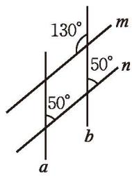
      
(第 1 题)

    

    

      
      
(第 2 题)

    

  

2. 如果只有直尺，你能在图中的方格纸上画出平行线吗？你是怎么画的？

3. 如图, 一条街道的两个拐角 $\angle ABC$ 与 $\angle BCD$ 均为 $150^{\circ}$ , 街道 $AB$ 与 $CD$ 平行吗? 为什么?

  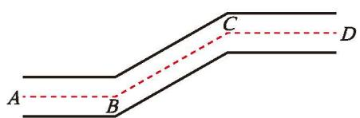
   
  
(第 3 题)

4. 如图, $\angle DAB + \angle CDA = 180^{\circ}, \angle ABC = \angle 1$ , 直线 $AB$ 与 $CD$ 平行吗? 为什么? 直线 $AD$ 与 $BC$ 呢?

  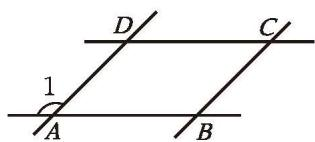
   
  
(第 4 题)

##### > 数学理解

5. 你能用一张形状不规则的纸（比如，如图所示的四边形的纸）折出两条平行的直线吗？与同伴说说你的折法。

  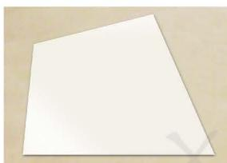
   
  
(第 5 题)

6. 图（1）是一种画平行线的工具。在画平行线之前，工人师傅往往要先调整一下工具 [如图（2）]，然后再画平行线 [如图（3）]。请说明这种工具的用法和其中的道理。

  

    

      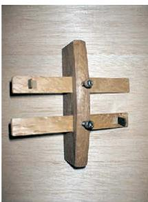
      
(1)

    

    

      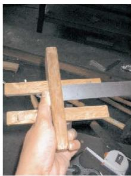
      
(2)

    

    

      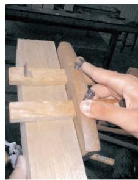
      
(3)

    

  

  
(第 6 题)

7. 直线 $l$ 的同侧有 $A, B, C$ 三点, 如果 $A, B$ 两点确定的直线 $l_{1}$ 与 $B, C$ 两点确定的直线 $l_{2}$ 都与 $l$ 平行, 那么 $A, B, C$ 三点的位置关系如何?

8. 观察下面每幅图中的直线 $a, b$ , 它们分别平行吗? 如何验证它们是否平行呢? 你有几种方法?

  

    

      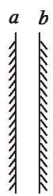
      
(1)

    

    

      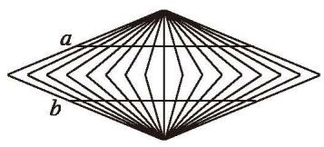
      
(2)

    

    

      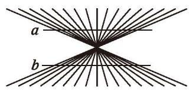
      
(3)

    

  

  
(第 8 题)

9. 利用如图所示的方法，可以折出“过已知直线外一点和已知直线平行”的直线。请说明其中的道理。

  

    

      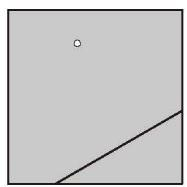
      
(1)

    

    

      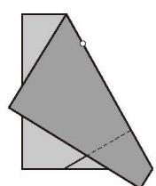
      
(2)

    

    

      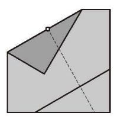
      
(3)

    

    

      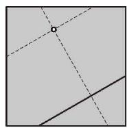
      
(4)

    

  

  
(第 9 题)

