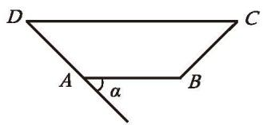
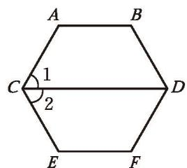
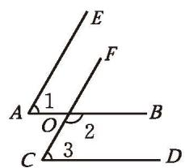
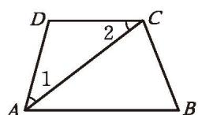
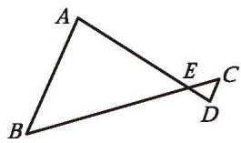
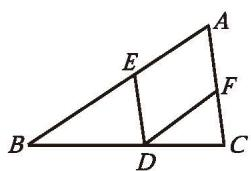
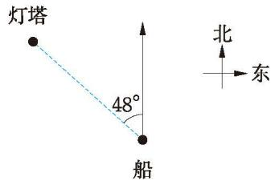
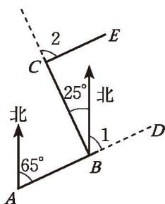

##### 习题 2.3

##### > 知识技能

1. 如图, $AB \parallel CD$ , $\angle \alpha = 45^{\circ}$ , $\angle D = \angle C$ , 依次求出 $\angle D$ , $\angle C$ , $\angle B$ 的度数。

  

    

      
      
(第 1 题)

    

    

      
      
(第 2 题)

    

  

2. 如图, $AB \parallel CD$ , $CD \parallel EF$ , $\angle 1 = \angle 2 = 60^{\circ}$ , $\angle A$ 和 $\angle E$ 各是多少度? 它们相等吗?

3. 如图，已知 $\angle 1 = \angle 3 = 60^{\circ}, \angle 2 = 120^{\circ}$ ，可以判定哪些直线平行？请说明理由。

  

    

      
      
(第 3 题)

    

    

      
      
(第 4 题)

    

  

4. 如图，已知 $AC$ 平分 $\angle BAD$ ， $\angle 1 = \angle 2$ ，可以判定哪两条直线平行？请说明理由。

5. 如图, $AB \parallel CD$ , $AD$ 与 $BC$ 相交于点 $E$ , $\angle B = 50^{\circ}$ , 求 $\angle C$ 的度数。

  

    

      
      
(第 5 题)

    

    

      
      
(第 6 题)

    

  

6. 如图, $AC \parallel ED$ , $AB \parallel FD$ , $\angle A = 64^{\circ}$ , 求 $\angle EDF$ 的度数。

##### > 问题解决

7. 如图, 从一艘船上测得一个灯塔所在的方向是北偏西 $48^{\circ}$ , 那么这艘船在这个灯塔的什么方向?

  
   
  
(第 7 题)

8. (1) 在地图上选定一个城市，判断其他城市在它的什么方向。  
(2) 只用方向能准确描述两个城市的相对位置吗? 如果不能, 还需要什么数据?

9. 林湾乡要修建一条灌溉水渠，如图，水渠从 $A$ 村沿北偏东 $65^{\circ}$ 方向到 $B$ 村，从 $B$ 村沿北偏西 $25^{\circ}$ 方向到 $C$ 村，然后从 $C$ 村到 $E$ 村。已知 $CE$ 的方向与 $AB$ 的方向一致，水渠从 $C$ 村应该沿什么方向修建？

  
   
  
(第 9 题)

