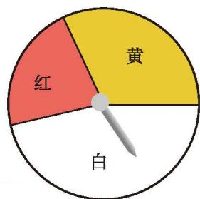
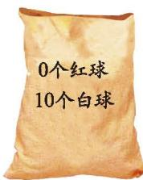
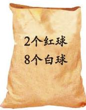
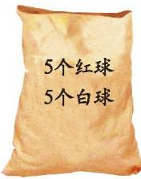
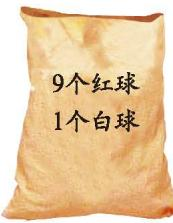
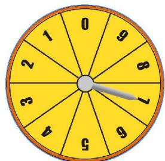

### 习题 3.1

##### > 知识技能

1. 一个袋中装有 8 个红球、2 个白球，每个球除颜色外都相同。任意摸出一个球，摸到哪种颜色球的可能性大？说说你的理由。

2. 右图是一个可以自由转动的转盘，转动转盘，当转盘停止时，指针落在哪个区域的可能性最大？请说明你的理由。

##### > 数学理解

  
   
  
(第 2 题)

3. 下图表示各袋中球的情况，每个球除颜色外都相同。任意摸出一个球，请你按照摸到红球的可能性由大到小进行排列。

  
  
  
   
  
(1) &emsp;&emsp;&emsp;&emsp;&emsp;&emsp;&emsp;&emsp;&emsp;&emsp;&emsp;&emsp; (2) &emsp;&emsp;&emsp;&emsp;&emsp;&emsp;&emsp;&emsp;&emsp;&emsp;&emsp;&emsp; (3)

  
  
   
  
(4) &emsp;&emsp;&emsp;&emsp;&emsp;&emsp;&emsp;&emsp;&emsp;&emsp;&emsp;&emsp;&emsp;&emsp;&emsp;&emsp;&emsp;&emsp;&emsp;&emsp;&emsp; (5)

  
(第 3 题)

4. 有的随机事件发生的可能性很小，有的随机事件发生的可能性很大，请举例说明，并用自己的语言描述随机事件发生的可能性大小。

##### > 问题解决

5. 右图是一个可以自由转动的转盘，利用这个转盘与同伴做下面的游戏：

  
   
  
(第 5 题)

(1) 自由转动转盘，每人分别将转出的数填入四个方格中的任意一个 $\square\square\square\square$；  
(2) 继续转动转盘，每人再将转出的数填入剩下的任意一个方格中；  
(3) 转动四次转盘后，每人得到一个"四位数"；  
(4) 比较两人得到的"四位数"，谁的大谁就获胜。  

多做几次上面的游戏。在做游戏的过程中，你的策略是什么？你积累了怎样的获胜经验？