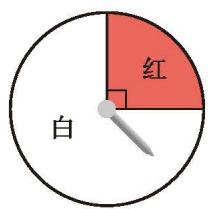
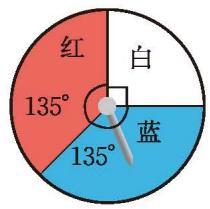
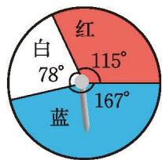
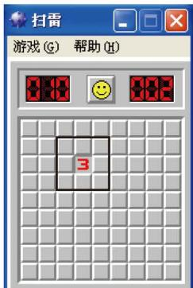
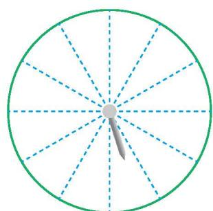

### 习题 3.3

##### > 知识技能

1. 任意掷一枚质地均匀的骰子。
   (1) 掷出的点数小于 4 的概率是多少？
   (2) 掷出的点数是奇数的概率是多少？
   (3) 掷出的点数是 7 的概率是多少？
   (4) 掷出的点数小于 7 的概率是多少？

2. 一道单项选择题有 A, B, C, D 四个备选答案，从中任意选一个答案，答案正确的概率是多少？

3. 在 7 张完全相同的卡片上分别写上数字 1, 1, 2, 2, 3, 4, 5，从中任意抽出一张。求：
   (1) 抽出标有数字 3 的卡片的概率；
   (2) 抽出标有数字 1 的卡片的概率；
   (3) 抽出标有数字为奇数的卡片的概率。

4. 一个袋中装有 5 个红球、4 个白球和 3 个黄球，每个球除颜色外都相同。从中任意摸出一个球，则：
   * $P(\text{摸到红球}) =$ \_\_\_\_；
   * $P(\text{摸到白球}) =$ \_\_\_\_；
   * $P(\text{摸到黄球}) =$ \_\_\_\_。

5. 一个袋中装有 3 个红球和 5 个白球，每个球除颜色外都相同。从中任意摸出一个球，摸到红球和摸到白球的概率相等吗？如果不相等，请通过改变袋中红球或白球的数量，使摸到红球和摸到白球的概率相等。

6. 任意掷一枚质地均匀的骰子，掷出的点数为 $6$ 的概率是 $\frac{1}{6}$。请通过改变骰子每个面上的点数，使掷出的点数为 $6$ 的概率是 $\frac{1}{3}$。

7. 如图所示的是三个可以自由转动的转盘。转动转盘，分别计算转盘停止时，指针落在红色区域的概率。

  
  
  
   
  
(1) &emsp;&emsp;&emsp;&emsp;&emsp;&emsp;&emsp;&emsp;&emsp;&emsp;&emsp;&emsp; (第 7 题) &emsp;&emsp;&emsp;&emsp;&emsp;&emsp;&emsp;&emsp;&emsp;&emsp;&emsp;&emsp; (3)

8. 如图，此为计算机"扫雷"游戏的画面，在 $9 \times 9$ 个小方格的"雷区"中，随机埋藏着 10 颗"地雷"，每个小方格最多能埋藏 1 颗"地雷"。小明游戏时先踩中一个小方格，显示数字 3，它表示与这个方格相邻的 8 个小方格（图中黑框所围区域，设为 A 区域）中埋藏着 3 颗"地雷"。为了尽可能不踩中"地雷"，小明的第二步应踩在 A 区域内的小方格上还是应踩在 A 区域外的小方格上？

  
   
  
(第 8 题)

##### > 数学理解

9. 请举出一些事件，它们发生的概率都是 $\frac{3}{4}$。

10. 用 10 个除颜色外完全相同的球设计摸球游戏。
    (1) 使得摸到红球的概率是 $\frac{1}{2}$，摸到白球的概率也是 $\frac{1}{2}$；
    (2) 使得摸到红球的概率是 $\frac{1}{5}$，摸到白球和黄球的概率都是 $\frac{2}{5}$。

11. 小明和小颖用一副去掉大王、小王的扑克牌做抽牌游戏：小明从中任意抽取一张牌（不放回），小颖从剩余的牌中任意抽取一张，谁抽到的牌面大谁就获胜（规定牌面从小到大的顺序为：2, 3, 4, 5, 6, 7, 8, 9, 10, J, Q, K, A，且牌面的大小与花色无关）。然后两人把抽到的牌都放回，重新开始游戏。
    (1) 现小明已经抽到的牌面为 4，然后小颖抽牌，那么小明获胜的概率是多少？小颖获胜的概率又是多少？
    (2) 若小明已经抽到的牌面为 2，情况又如何？若小明已经抽到的牌面为 A 呢？

12. (1) 请设计一个转盘：自由转动这个转盘，当它停止时，指针落在红色区域的概率是 $\frac{4}{9}$，落在白色区域的概率是 $\frac{1}{3}$，落在黄色区域的概率是 $\frac{2}{9}$。
    ※(2) 请设计一个转盘：自由转动这个转盘，当它停止时，指针落在红色区域的概率是 $\frac{3}{8}$，落在白色区域的概率是 $\frac{3}{8}$，落在黄色区域的概率是 $\frac{3}{8}$。你能完成这一任务吗？

##### > 问题解决

13. 小明所在的班有 40 名同学，从中选出一名同学为家长会做准备工作。请你设计一种方案，使每一名同学被选中的概率都相同。

14. 如图所示，一个转盘被等分成 12 个扇形。
    (1) 请为该转盘设计一个涂色方案，使得自由转动这个转盘，当它停止时，指针落在红色区域的概率是 $\frac{1}{3}$。

  
   
  
(第 14 题)

对于 (1)，你还有其他的涂色方案吗？你是怎样设计这些涂色方案的？