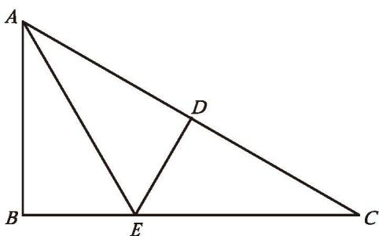

### 习题 4.2

##### 知识技能

1. 如图，已知 $\triangle OAD \cong \triangle OBC$ ， $\angle O = 70^{\circ}$ ， $\angle C = 26^{\circ}$ ，求 $\angle OAD$ 的度数。

  
  
   
  
(第 1 题) &emsp;&emsp;&emsp;&emsp;&emsp;&emsp;&emsp;&emsp;&emsp;&emsp;&emsp;&emsp;&emsp;&emsp;&emsp;&emsp; (第 2 题)

2. 如图，已知 $\triangle ABC \cong \triangle FDE$ ， $AD = 1 \text{ cm}$ ， $BD = 2 \text{ cm}$ ， $\angle A = 40^{\circ}$ ， $\angle E = 62^{\circ}$ ，求 $FD$ 的长，以及 $\angle C$ ， $\angle FDE$ 的度数。

##### 数学理解

3. 如图，已知 $\triangle ABE \cong \triangle ADE$ ， $\triangle ADE \cong \triangle CDE$ ， $AB$ 与 $CD$ 相等吗？为什么？

  
   
  
(第 3 题)

