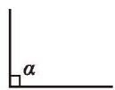
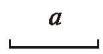
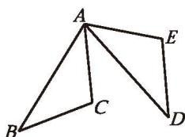
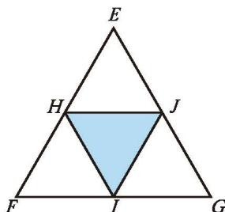
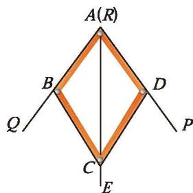
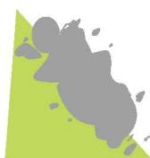

### 习题 4.3

##### 知识技能

1. 如图，已知线段 $a$ ，用尺规作 $\triangle ABC$ ，使 $AB = a, BC = AC = 2a$ 。

  
  
  
   
  
(第 1 题) &emsp;&emsp;&emsp;&emsp;&emsp;&emsp;&emsp;&emsp;&emsp;&emsp;&emsp;&emsp; (第 2 题) &emsp;&emsp;&emsp;&emsp;&emsp;&emsp;&emsp;&emsp;&emsp;&emsp;&emsp;&emsp; (第 3 题)

2. 图中的两个三角形全等吗？请说明理由。

3. 图中的两个三角形有几对相等的角？这两个三角形全等吗？请说明理由。

4. 如图，已知 $\angle \alpha$ 和线段 $a$ ，用尺规作一个三角形，使它的一个内角等于 $\angle \alpha$ ，另一个内角等于 $2\angle \alpha$ ，且这两个内角的夹边等于 $a$ 。

  
  
   
  
(第 4 题) &emsp;&emsp;&emsp;&emsp;&emsp;&emsp;&emsp;&emsp;&emsp;&emsp;&emsp;&emsp;&emsp;&emsp;&emsp;&emsp; (第 5 题)

5. 如图，点 $E$ 在 $AB$ 上， $AC = AD$ ， $\angle CAB = \angle DAB$ ， $\triangle ACE$ 与 $\triangle ADE$ 全等吗？ $\triangle ACB$ 与 $\triangle ADB$ 呢？请说明理由。

6. 如图，已知直角 $\alpha$ 和线段 $a, b$ ，用尺规作一个直角三角形，使它的两条直角边分别等于 $a, b$ 。

  

  

  
  
   
  
(第 6 题) &emsp;&emsp;&emsp;&emsp;&emsp;&emsp;&emsp;&emsp;&emsp;&emsp;&emsp;&emsp;&emsp;&emsp;&emsp;&emsp; (第 7 题)

7. 如图， $C$ 是线段 $AB$ 的中点， $\angle D = \angle E$ ， $\angle A = \angle B$ 。请在图中找出两对全等三角形，并说明理由。

##### 数学理解

8. 准备几根硬纸条。
(1) 取出三根硬纸条钉成一个三角形，你能拉动其中两边，使这个三角形的形状发生变化吗？
(2) 取出四根硬纸条钉成一个四边形，拉动其中两边，这个四边形的形状改变了吗？钉成一个五边形，又会怎样？
(3) 上面的现象说明了什么？

9. 两个锐角分别相等的两个直角三角形全等吗？为什么？

10. 如图， $AB = AD$ ， $AC = AE$ ， $\angle BAC = \angle DAE$ ， $\angle B$ 与 $\angle D$ 相等吗？小丽的思考过程如下。

  
   
  
(第 10 题)

  

在 $\triangle ABC$ 和 $\triangle ADE$ 中，
因为 $AB = AD, \angle BAC = \angle DAE, AC = AE,$ 所以 $\triangle ABC \cong \triangle ADE,$ 所以 $\angle B = \angle D$ 。

请说明小丽每一步的理由。

11. 如图， $\triangle EFG$ 的三边相等，三个内角也相等，点 $H, I, J$ 分别在 $\triangle EFG$ 的三边上。

  
   
  
(第 11 题)

(1) 如果 $H, I, J$ 分别为 $\triangle EFG$ 三边的中点，那么 $\triangle EHJ, \triangle FIH$ ， $\triangle GJI$ 全等吗？ $\triangle HIJ$ 的三边相等吗？
(2) 如果 $HF = \frac{1}{3} EF$ ， $IG = \frac{1}{3} FG$ ， $JE = \frac{1}{3} GE$ ，那么 $\triangle EHJ$ ， $\triangle FIH$ ， $\triangle GJI$ 全等吗？ $\triangle HIJ$ 的三边相等吗？
(3) 请你尝试提出一个更一般的问题。

##### 问题解决

12. 如图，仪器 ABCD 可以用来平分一个角，其中 AB = AD, BC = DC，将仪器上的点 A 与 $\angle PRQ$ 的顶点 R重合，调整 AB 和 AD，使它们落在角的两边上，沿 AC 画一条射线 AE, AE 就是 $\angle PRQ$ 的平分线。你认为这样合理吗？为什么？

  
   
  
(第 12 题)

13. 列举生活中运用三角形稳定性的案例。

14. 如图，小明不慎将一块三角形模具打碎为两块，他如果只带其中的一块碎片到商店去，能否配一块与原来一样的三角形模具呢？如果可以，带哪块去合适？为什么？

  
   
  
(第 14 题)

15. 如图，小颖作业本上画的三角形被污染，她想重新画出一个与原来完全一样的三角形，她该怎么办？请帮助小颖想出一个办法，并说明你的理由。

  
   
  
(第 15 题)

16. 先画一个 $\triangle ABC$ ，然后选择 $\triangle ABC$ 中适当的边和角，用尺规作出与 $\triangle ABC$ 全等的三角形（在所作的三角形中标出用到的条件）。