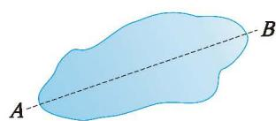
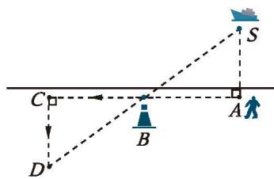

### 习题 4.4

##### 知识技能

1. 如图，一条输电线路需跨越一个池塘，池塘两侧 $A$ ， $B$ 处各立有一根电线杆，但利用现有皮尺无法直接量出 $A$ ， $B$ 间的距离。请你设计一个方案，测出 $A$ ， $B$ 间的距离，并说明理由。

  
   
  (第1题)

##### 数学理解

2. 如图，小明站在堤岸的 $A$ 点处，正对他的 $S$ 点处停有一艘游艇。他想知道这艘游艇距离他有多远，于是他沿堤岸走到电线杆 $B$ 旁，接着再往前走相同的距离，到达 $C$ 点。然后他向左直行，当看到电线杆与游艇在一条直线上时停下来，此时他位于 $D$ 点。那么 $C, D$ 两点间的距离就是在 $A$ 点处小明与游艇的距离。你知道这是为什么吗？

  
   
  (第2题)

3. 利用全等三角形测距离的关键是什么？请查阅资料，了解利用全等三角形测距离的更多具体方法或具体场景。

