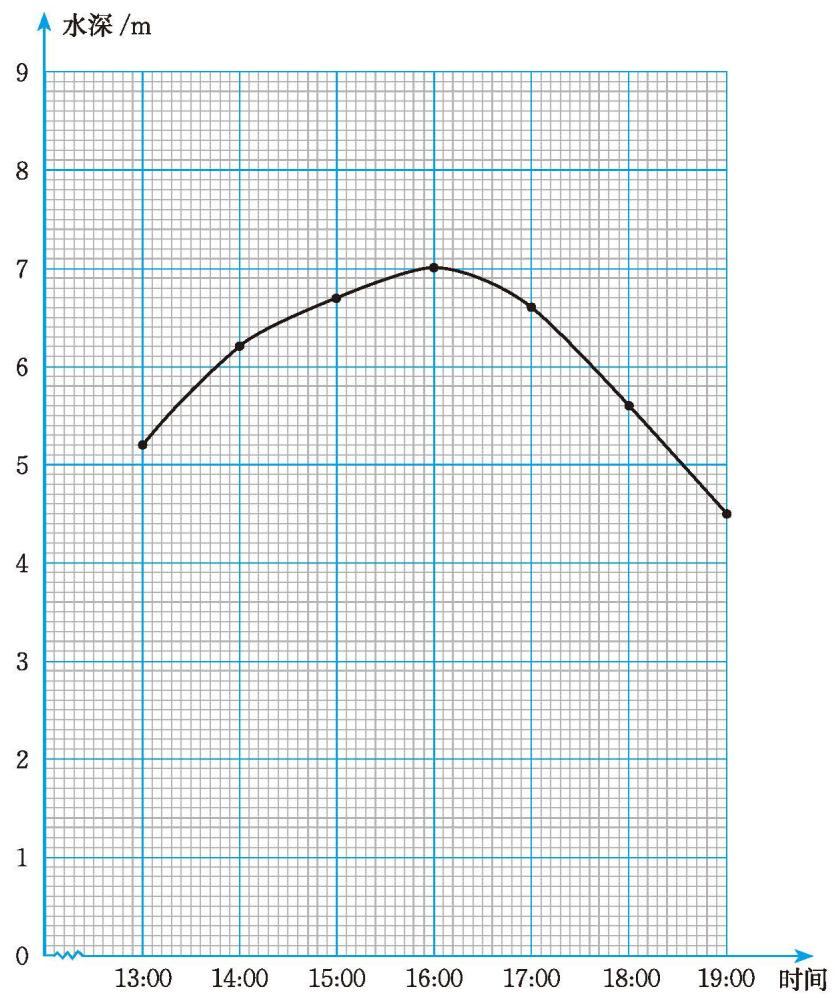

### 习题 6.1

##### 知识技能

1. 下图表示某港口某日从 13:00 到 19:00 水深变化的情况。
   (1) 图中反映了哪两个变量之间的关系？其中，哪个是自变量，哪个是因变量？
   (2) 请描述水深随时间的变化而变化的情况。

  
   
  (第 1 题)

##### 问题解决

2. 在某些情况下，可以按照体表面积计算用药剂量。有一种针对体重在 $30 \mathrm{~kg}$ 以下儿童的计算方法：

   儿童体表面积（单位：$m^{2}$）= 0.035 × 体重（单位：kg）+ 0.1，

   某种药儿童用药剂量 = 该药成人用药剂量 × 儿童体表面积 ÷ 1.73。

   (1) 这个情境中有哪些变量？随着儿童体重的增加，其他量会发生怎样的变化？
   (2) 有一种药物，成人每次用药剂量为 $1 \mathrm{~g}$。按照上述方法，体重为 $15 \mathrm{~kg}$ 的儿童每次用药剂量大约是多少？
