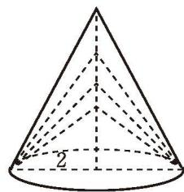
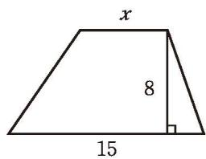

### 习题 6.3

##### 知识技能

1. 如图，圆锥的底面半径是 $2 \mathrm{~cm}$，当圆锥的高由小到大变化时，圆锥的体积也随之发生了变化。
   (1) 在这个变化过程中，自变量、因变量各是什么？
   (2) 如果圆锥的高为 $h$ (单位：$\mathrm{cm}$)，那么圆锥的体积 $V$ (单位：$\mathrm{cm}^{3}$) 如何表示？

  
   
  (第 1 题)

(3) 当圆锥的高由 $1 \mathrm{~cm}$ 变化到 $10 \mathrm{~cm}$ 时，它的体积是如何变化的？

##### 数学理解

2. 如图，梯形上底的长是 $x \mathrm{~cm}$，下底的长是 $15 \mathrm{~cm}$，高是 $8 \mathrm{~cm}$，面积是 $y \mathrm{~cm}^{2}$。
   (1) 写出 $y$ 与 $x$ 之间的关系式。
   (2) 用表格表示当 $x$ 从 4 变到 14 时 (每次增加 1)，$y$ 的相应值。

  
   
  (第 2 题)

(3) 当 $x$ 每增加 1 时，$y$ 如何变化？说说你的理由。
(4) 当 $x = 0$ 时，$y$ 等于什么？此时它表示的是什么？

##### 问题解决

3. 计算你家本月的二氧化碳排放量，并与"尝试·交流"中小明家相应的项目进行比较，谁家的生活更"低碳"些？你对家人有什么建议？
