### 习题 6.4

##### 知识技能

1. 一位患者今天发烧了。他在早晨烧得很厉害，吃过药后感觉好多了，中午时体温基本正常。但是下午他的体温又开始上升，直到夜里他才感觉体温基本正常了。下面哪一幅图能较好地刻画出这位患者今天体温的变化情况？

  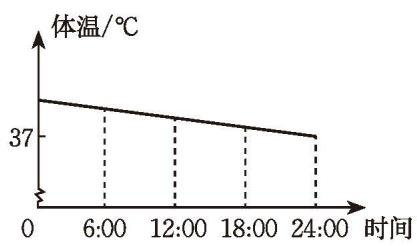

  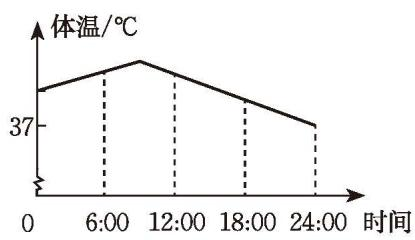
  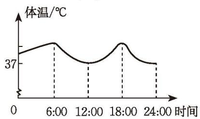
   
  (1) &emsp;&emsp;&emsp;&emsp;&emsp; (2)

  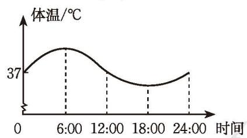
   
  (3) &emsp;&emsp;&emsp;&emsp;&emsp; (4)

(第 1 题)

##### 数学理解

2. 小华站在离家不远的公共汽车站等车。下面哪一幅图能较好地刻画等车这段时间内他离家的距离与时间之间的关系？

  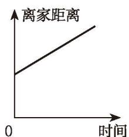

  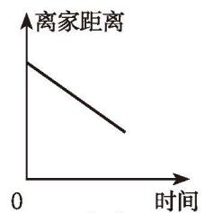
  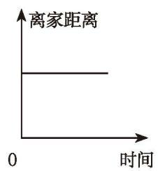
   
  (2) &emsp;&emsp;&emsp;&emsp;&emsp; (3)

  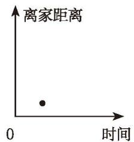
   
  (4)

(第 2 题)

3. 小明与家人在一次户外骑行途中骑车速度与时间之间的关系如图所示，请你想象并描述他们骑行途中的情境。

  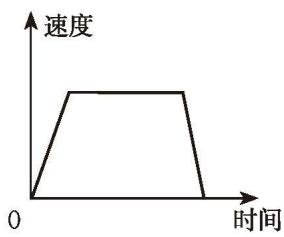
   
  (第 3 题)

##### 问题解决

4. 如果不复习，学习过的知识会随时间的推移而逐渐被遗忘。德国心理学家艾宾浩斯（Hermann Ebbinghaus, 1850-1909）最早研究了记忆遗忘规律。他根据自己得到的测试数据描绘了一条曲线（如图所示），这就是艾宾浩斯遗忘曲线。

  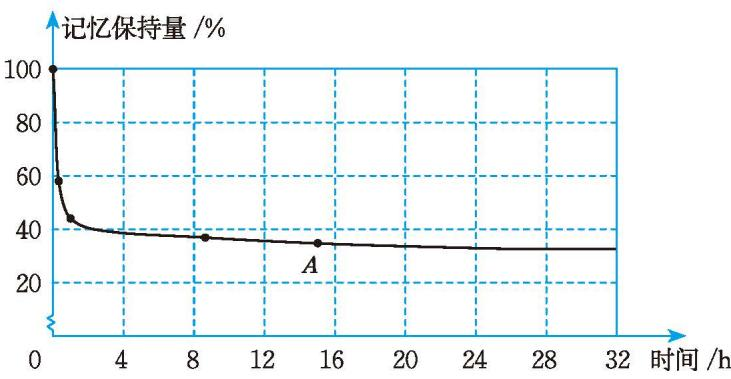
   
  (第 4 题)

观察图象，回答下列问题：
(1) 经过 $2 \mathrm{~h}$，记忆保持了多少？
(2) 图中 $A$ 点表示什么？在哪个时间段内遗忘的速度最快？
(3) 有研究表明，如及时复习，经过一天记忆能保持 $98 \%$。根据遗忘曲线，如不复习，结果又怎样？由此，你有什么感悟？

5. 下图统计了张明某次体检时口服葡萄糖溶液后每隔 $30 \mathrm{~min}$ 测得的血糖浓度（单位：$\mathrm{mmol} / \mathrm{L}$）。

  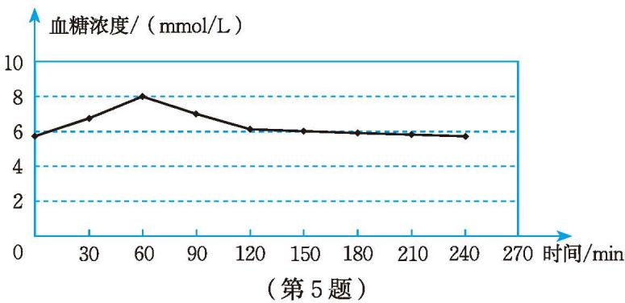

观察图象，回答下列问题：
(1) 请描述张明这次体检口服葡萄糖溶液后 $240 \mathrm{~min}$ 内血糖浓度的变化情况。
(2) 张明这次体检血糖浓度的最高值是多少，是何时达到的？最低值呢？
(3) 张明这次体检的血糖浓度在哪个时间段上升得比较快？在哪个时间段下降得比较快？
