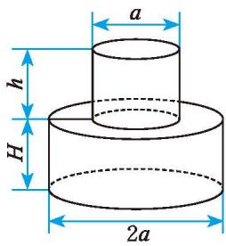
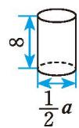

### 习题1.4

##### 知识技能

1. 计算：  
(1) $8a^{4}b^{3}c \div 2a^{2}b^{3} \cdot (-\frac{2}{3} a^{3}bc^{2})$ ;  
(2) $(3x^{2}y)^{2} \cdot (-15xy^{3}) \div (-9x^{4}y^{2})$ ;  
(3) $(-4a^{3} + 6a^{2}b^{3} + 3a^{3}b^{3})\div (-4a^{2});$

$$
(4) (\frac {2}{5} m n ^ {3} - m ^ {2} n ^ {2} + \frac {1}{6} n ^ {4}) \div \frac {2}{3} n ^ {2};
$$

$$
(5) (\frac {1}{1 0} x y ^ {2} + \frac {1}{4} y ^ {2} - \frac {1}{2} y) \div \frac {1}{5} y;
$$

$$
(6) [ (x + 1) (x + 2) - 2 ] \div x _ {\circ}
$$

##### 问题解决
2. 一只圆柱形桶内装满了水，已知桶的底面直径为 $a$ ，高为 $b$ 。又知另一个长方体形容器的长为 $b$ ，宽为 $a$ 。如果把这只圆柱形桶中的水全部倒入这个长方体形容器中（水不溢出），那么水面的高度是多少？

3. 如图（单位：$\text{cm}$），图（1）的瓶子中盛满了水，如果将这个瓶子中的水全部倒入图（2）这样的杯子中，那么一共需要多少个这样的杯子？

  

    

      
      
(1) 瓶子

    

    

      
      
(2) 杯子

    

  

  
(第 3 题)

