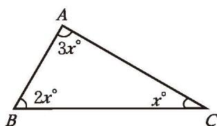
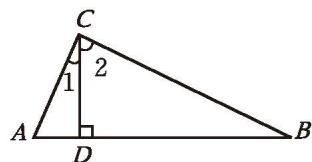
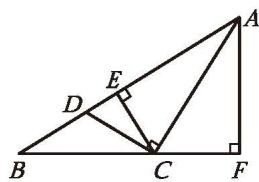
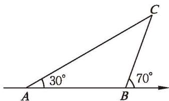
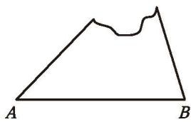
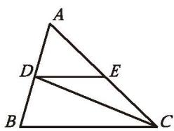

### 习题4.1

##### 知识技能

1. 如图，求△ABC各内角的度数。

2. 在下面的空白处，分别填入"锐角""钝角"或"直角"：

  
   
  (1)

(第1题)

(2) 如果三角形的一个内角等于另外两个内角之和，那么这个三角形是\_\_\_\_三角形；
(3) 如果三角形的两个内角都小于 $40^{\circ}$ ，那么这个三角形是\_\_\_\_三角形。

3. 在直角三角形中，较大锐角是较小锐角的 2 倍，求较大锐角的度数。

4. 如图，已知 $\angle ACB = 90^{\circ}, CD \perp AB$ ，垂足是 $D$ 。
(1) 图中有几个直角三角形？是哪几个？分别说出它们的直角边和斜边。
(2) $\angle 1$ 和 $\angle A$ 有什么关系？ $\angle 2$ 和 $\angle A$ 呢？

  
   
  (第4题)

5. 下列每组数据分别是三根小棒的长度，用它们能摆成三角形吗？实际摆一摆，验证你的结论。
(1) 3 cm, 4 cm, 5 cm; (2) 8 cm, 7 cm, 15 cm;
(3) 13 cm, 12 cm, 20 cm; (4) 5 cm, 5 cm, 11 cm。

6. 如图，在 $\triangle ABC$ 中， $BC$ 边上的高是 $\_\_\_$ ， $AB$ 边上的高是 $\_\_\_$ ；在 $\triangle BCE$ 中， $BE$ 边上的高是 $\_\_\_$ ， $EC$ 边上的高是 $\_\_\_$ ；在 $\triangle ACD$ 中， $AC$ 边上的高是 $\_\_\_$ ， $CD$ 边上的高是 $\_\_\_$ 。

$AB$ 边上的高 $BG$

  
   
  (第6题)

7. 在 $\triangle ABC$ 中， $\angle BAC=60^{\circ}$ ， $\angle B=45^{\circ}$ ， $AD$ 是 $\triangle ABC$ 的一条角平分线，求 $\angle ADB$ 的度数。

8. 下图中， $\triangle ABC$ 的 $BC$ 边上的高画得对吗？ $AB$ 边上的高呢？若不对，请改正。

|  |  |
| :---: | :---: |
|  |  |
| (1) | (2) |

(第8题)

##### 问题解决

9. 如图，一艘轮船按箭头所示方向行驶， $C$ 处有一座灯塔。
(1) 当轮船从 A 点行驶到 B 点时， $\angle ACB$ 的度数是多少？

  
   
  (第9题)

(2) 轮船行驶到哪一点时距离灯塔最近？为什么？
(3) 根据这一情境，你还能提出哪些问题？

10. 你在小学学习时是如何探索三角形内角和的？本节你探索三角形内角和的方法与在小学学习的方法有什么不同？

11. 等腰三角形一边长 9 cm，另一边长 4 cm，它的第三边的长是多少？为什么？

12. 小亮想用长度均为奇数（单位：cm）的三根小棒摆成一个三角形，其中两根小棒的长度分别为 $9 \mathrm{~cm}$ 和 $3 \mathrm{~cm}$ ，第三根小棒的长度可以是多少厘米？

13. 一个缺角的三角形残片如图所示。
(1) 不恢复这个缺角，你能画出 $AB$ 边上的高所在的直线吗？你是如何画的？依据是什么？
(2) 小明分别画出 $\angle A$ 和 $\angle B$ 的平分线，两线交于点 $D$ ，又找到 $AB$ 边的中点 $E$ ，画直线 $DE$ ，小明说他画出了第三个角的角平分线所在的直线。你认为他说的对吗？为什么？

  
   
  (第13题)

14. 如图，在 $\triangle ABC$ 中， $\angle A = 62^{\circ}$ ， $\angle B = 74^{\circ}$ ， $CD$ 是 $\triangle ABC$ 的角平分线，点 $E$ 在 $AC$ 上，且 $DE \parallel BC$ ，求 $\angle EDC$ 的度数。

  

15. 请查阅资料了解重心的意义，以及确定一个物体重心的一些方法。

(第14题)
