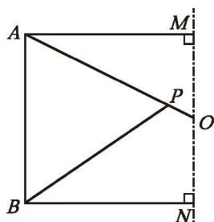

### 习题5.1
##### 知识技能

1. 下列汉字中，哪些可以看成轴对称图形？请你再找出几个类似的汉字。

##### 草木水中

2. 在下列图形中，找出轴对称图形，并找出它的两组对应点。

|  |  |  |
| :---: | :---: | :---: |
|  |  |  |
| (1) | (2) | (3) |
(第2题)

|  |  |
| :---: | :---: |
|  |  |
| (4) | (5) |

##### 数学理解

3. 如图，将长方形纸片 $ABCD$ 沿 $EF$ 折叠，点 $A$ ， $B$ 分别落在点 $A'$ ， $B'$ 处。如果 $\angle EFB' = 70^\circ$ ，那么 $\angle CFB'$ 是多少度？

|  |  |
| :---: | :---: |
|  |  |
| (第3题) | (第4题) |

4. 如图所示的图形是由一张纸对折后（两部分完全重合）得到的，展开折纸，你能得到什么样的图形？

##### 问题解决

5. 一个轴对称图形的一半如图所示，直线 $MN$ 是这个轴对称图形的对称轴，请画出这个图形的另一半。

  
   
  (第5题)

##### 联系拓广

&emsp;※6. (1) 一次晚会上，主持人出了一道题目："如何把 $\exists + \exists = \emptyset$ 变成一个真正的等式？" 很长时间没人答出。小兰仅仅拿了一面镜子，就很快解决了这个问题。你知道她是怎么做的吗？
(2) 请你编一道与 (1) 类似的题目。
