### 习题5.2

##### 知识技能

1. 如图，在下面的等腰三角形中， $\angle A$ 是顶角，分别求出它们的底角的度数。

|  |  |
| :---: | :---: |
| 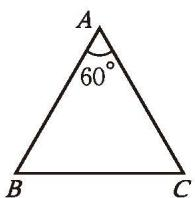 | 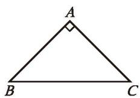 |
| (1) | (2) |

(第1题)

  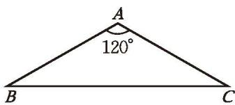
   
  (3)

2. 画一条线段 $AB$ ，用尺规将它四等分。

3. 任意画一个三角形，用尺规作三角形三条边的垂直平分线，观察这三条垂直平分线的位置关系，你发现了什么？再换一个三角形试一试。

4. 任意画一个三角形，用尺规作三角形三个内角的平分线。

##### 数学理解

5. 等腰三角形的底角可能是锐角吗？可能是直角吗？可能是钝角吗？请说明理由。

6. 在等腰三角形 $ABC$ 中，已知 $\angle A = 100^{\circ}$ ，你知道这个等腰三角形的底角是多少度吗？如果 $\angle A = 30^{\circ}$ 呢？

7. 如图，在 $\triangle ABC$ 中， $AB \neq AC$ ，线段 $AM$ 是它的一条中线，点 $P$ 是线段 $AM$ 上的一点，你认为 $PB$ 与 $PC$ 相等吗？如果 $AB = AC$ 呢？为什么？

  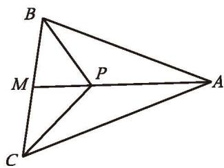
   
  (第7题)

8. 在线段 $AB$ 的垂直平分线上任取两个不同的点 $M, N$ ，则 $\angle MAN$ 和 $\angle MBN$ 之间有什么关系？为什么？

9. 把两个同样大小的含 $30^{\circ}$ 角的三角尺按如图所示那样放置，其中 $M$ 是 $AD$ 与 $BC$ 的交点，这时 $MC$ 的长度就等于点 $M$ 到 $AB$ 的距离。你知道这是为什么吗？

|  |  |
| :---: | :---: |
| 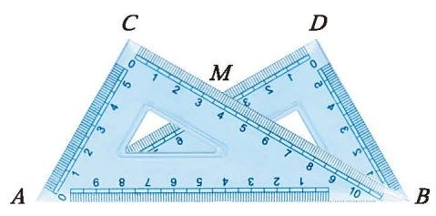 | 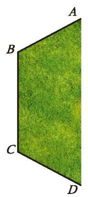 |
| (第9题) | (1) |

(第10题)

  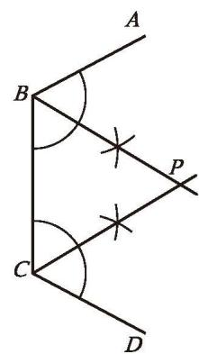
   
  (2)

10. 校园一角的形状如图（1）所示，其中 $AB, BC, CD$ 表示围墙。如图（2）所示，小亮通过作角平分线在图示的区域中找到了一点 $P$ ，使得点 $P$ 到三面墙的距离都相等。请解释他这样做的道理。

&emsp;※11. 请用等腰三角形"三线合一"的性质解释例3作法的道理。

##### 问题解决

12. (1) 等腰直角三角形是特殊的等腰三角形，它的底角有何特征？
(2) 请仿照 (1) 再提出一个问题。

13. 如图，一张纸上有 $A, B, C, D$ 四个点，请用尺规找出一点 $M$ ，使得 $MA = MB$ ， $MC = MD$ 。

  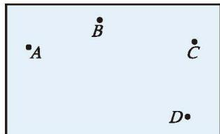
   
  (第13题)

14. 请将一个等边三角形分成8个全等的直角三角形。

  

### ☆ 问题解决策略：转化

数学学习中，常常会将新研究的问题转化为以前研究过的熟悉的问题。转化是解决数学问题的一种重要策略。

问题 如图 5-23，某工厂计划在一条笔直的道路上设立一个储物点，工作人员每天进入工厂大门后，先到储物点取物品，然后再到车间。你认为该储物点应建在什么地方，才能使工作人员所走的路程最短？

  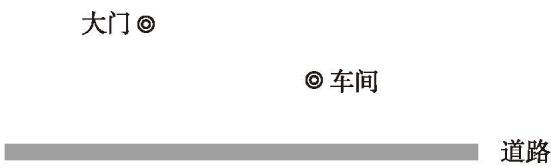
   
  图5-23

##### 理解问题

如果把大门、车间和储物点所在的位置都看作点，把道路看作一条直线，那么上述问题可以抽象成怎样的数学问题？试着写一写、画一画。

##### 拟订计划

(1) 你以前遇到过类似的问题吗？关于"最短"，你有哪些认识？
(2) 相信你能解决以下问题：如图 5-24，直线 $l$ 的两侧分别有 $A$ ， $B$ 两点，在直线 $l$ 上确定一个点 $C$ ，使 $AC + CB$ 最短。原问题与图 5-24 这个问题有什么区别和联系？你能将原问题转化为图 5-24 这样的问题吗？说说你的想法。

  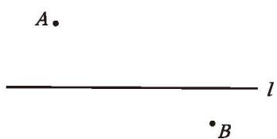
   
  图5-24

##### 实施计划

写出你的解决方案，并说明道理。

小明的思考过程如下。

如图 5-25，作点 $B$ 关于 $l$ 的对称点 $B'$ ，根据轴对称的性质，对于 $l$ 上任意一点 $C$ ，都有 $BC = B'C$ ，因此 $AC + BC = AC + B'C$ ，问题转化为：在直线 $l$ 上确定一个点 $C$ ，使 $AC + B'C$ 最短。

根据"两点之间线段最短"，连接 $AB'$ ，与 l 交于点 C，点 C 就是所要确定的点。

  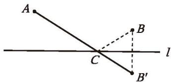
   
  图5-25

##### 回顾反思

(1) 回顾本题的解决过程，你有哪些感悟？
(2) 利用转化策略解决问题时，需要注意些什么？

在这个问题中，小明利用轴对称，将两点位于直线 l 同一侧的问题，转化为两点分别位于直线 l 两侧的问题，从而使问题得以解决。通过转化，可以把一个问题转化为与它等价的问题，达到化繁为简、化难为易、化不熟悉为熟悉的目的。

请用转化策略解答下列问题。

1. 如图 5-26，正方形的边长为 1，以各边为直径在正方形内画半圆，求图中阴影部分的面积。

|  |  |
| :---: | :---: |
| 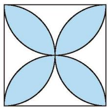 | 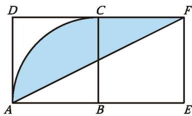 |
| 图5-26 | 图5-27 |

2. 如图 5-27，四边形 $ABCD$ 和四边形 $BEFC$ 都是边长为 2 的正方形。以点 $B$ 为圆心、 $AB$ 的长为半径的圆与正方形 $ABCD$ 交于 $A$ ， $C$ 两点，连接 $AF$ 。求图中阴影部分的面积。

3. (1) 有两堆数量相等的棋子，甲、乙两人轮流在其中任意一堆里取，每次取的棋子数量不限，但不能不取。规定取得最后一枚者获胜。你认为获胜的策略是什么？
(2) 如果两堆棋子的数量不相等，获胜的策略又是什么？

4. 如图 5-28，定点 $P$ 位于 $\angle AOB$ 的内部，在射线 $OA$ 和 $OB$ 上分别确定点 $M, N$ ，使得 $\triangle PMN$ 的周长最小。

  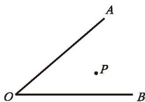
   
  图5-28

  

