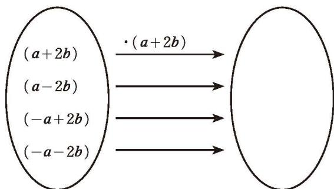
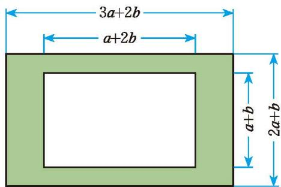
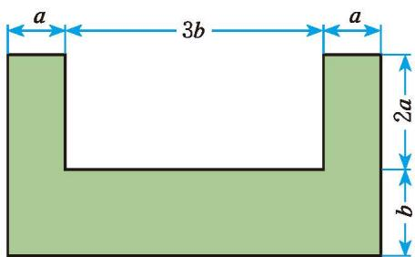
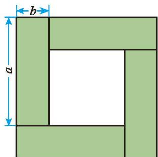
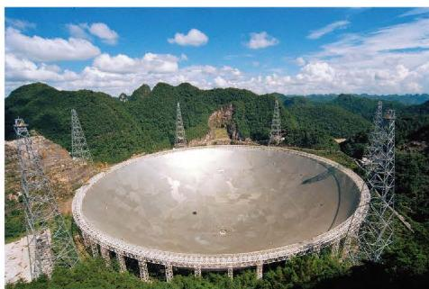
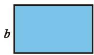
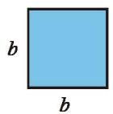
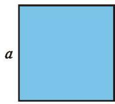
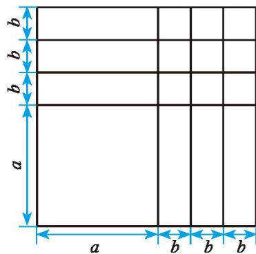

## 整式的乘除 复习题

##### > 知识技能

1. 计算：  
(1) $(- \frac{3}{5})^2 \cdot (-\frac{3}{5})^3$ ;  
(3) $(a + b)^{3} \div (a + b)$ ;  
(5) $(-a)^2 \cdot (a^2)^2$ ;  
(7) $a^{n + 1}\cdot a^{n - 1}(n > 1)$ ;

2. 计算：  
(1) $10^{5} \div 10^{-1} \times 10^{0}$ ;  
(3) $(\frac{1}{3})^0 \div (-\frac{1}{3})^{-2}$ 。

3. 一个正方体的棱长为 $2 \times 10^{2} \mathrm{~mm}$ 。  
(1) 它的表面积是多少平方米?  
(2) $(-a^5)^5$ ;  
(4) $(-a^{2} \cdot b)^{3}$ ;  
(6) $(y^{2})^{3} \div y^{6}$ ;  
(8) $(-c^2)^{2n}$ 。  
(2) $16 \times 2^{-4}$ ;  
(2) 它的体积是多少立方米?

4. 计算：  
(1) $(x + a)(x + b)$ ;  
(2) $(3x + 7y)(3x - 7y)$ ;  
(3) $(3x + 9)(6x + 8)$ ;  
(5) $\frac{1}{3} a^2 b^3 \cdot (-15a^2 b^2)$ ;  
(4) $\left(\frac{1}{2}x^{2}y-2xy+y^{2}\right)\cdot3xy;$  
(6) $(4a^{3}b - 6a^{2}b^{2} + 12ab^{3})\div 2ab;$  
(7) $(a^2 bc)^2 \div ab^2 c;$  
(8) $(3mn + 1)(3mn - 1) - 8m^{2}n^{2}$ 。

5. 计算：  
(1) $10^{7}\div(10^{3}\div10^{2})$ ;  
(3) $4 \times 2^{n} \times 2^{n-1} (n > 1)$ ;  
(2) $(x - y)^{3}(x - y)^{2}(y - x)$ ;  
(5) $(y^{2} \cdot y^{3}) \div (y \cdot y^{4})$ ;  
(4) $(-x)^{3} \cdot x^{2n-1} + x^{2n} \cdot (-x)^{2}$ ;  
(6) $x^{2}\cdot x^{3}+x^{7}\div x^{2};$  
(7) $m^5 \div m^2 \cdot m$ ;  
(8) $a^{4}+(a^{2})^{4}-(a^{2})^{2}$ 。

6. 计算：  
(1) $(2x^{2})^{3}-6x^{3}(x^{3}+2x^{2}+x)$ ; (2) $(x+y+z)(x+y-z)$ ;  
(3) $[(x+y)^{2}-(x-y)^{2}]\div2xy;$ (4) $a^{2}(a+1)^{2}-2(a^{2}-2a+4)$ 。

7. 求下列各式的值:  
(1) $3x^{2}+(-\frac{3}{2}x+\frac{1}{3}y^{2})(2x-\frac{2}{3}y)$ ，其中x=2，y=-1；
$$
[ (x y + 2) (x y - 2) - 2 x ^ {2} y ^ {2} + 4 ] \div x y
$$

$$
x = 1 0, y = - \frac {1}{2 5}
$$  
(3) $x(x + 2y) - (x + 1)^2 + 2x$ ，其中 $x = \frac{1}{25}$ ， $y = -25$ 。

8. 利用整式乘法公式计算:  
(1) $2001^{2}$ ; (2) $2001 \times 1999$ ; (3) $99^{2} - 1$ ;  
(4) $899 \times 901 + 1$ ; (5) $123^{2} - 124 \times 122$ 。

9. 把下图左框里的整式分别乘 $(a+2b)$ ，将所得的积写在右框相应的位置上。

(第9题)
10. 分别计算下图中阴影部分的面积。

(1)
(第10题)

(2)
##### > 数学理解

11. 如图, 4个长为 $a$ 、宽为 $b$ 的小长方形围成了一个大正方形, 请用不同方法计算阴影部分的面积。你能得到怎样的等式? 请验证它的正确性。

12. 请在下列横线上填上适当的式子:  
(1) $(\_+3b)(2a-3b)=4a^{2}-$ ;

(2)
$(2x + \_\_)^2 = \_\_ + 20xy + \_\_;$  
(3) $(x + 2)(x + \_) = x^{2} + \_ x + 2;$

(第11题)  
(4) $(\_ + 4y)(x + 2y) = 3x^{2} + \_ xy + 8y^{2}$ 。

##### > 问题解决

13. 如图, 我国自主研发的 $500 \mathrm{~m}$ 口径球面射电望远镜 (FAST) 有 “中国天眼” 之称, 它的反射面面积约为 $2.5 \times 10^{5} \mathrm{~m}^{2}$ ; 一个 11 人制正规足球场的面积约为 $7.14 \times 10^{3} \mathrm{~m}^{2}$ 。“中国天眼”的反射面面积大约相当于多少个 11 人制正规足球场的面积 (结果精确到 1 个)?

(第13题)
14. 某种原子的质量约为 0.000 000 000 000 000 000 000 000 019 93 g，请用科学记数法把它表示出来。

15. 分别准备几张如图所示的长方形和正方形卡片。  
(1) 用这些卡片拼一些新的长方形, 并计算新长方形的面积;  
(2)从这些卡片中选取几张,用它们拼成一个面积为 $(2a^{2}+3ab)$ 的长方形。

  
a

(第15题)
  
a

16. 请在图中指出面积为 $(a + 3b)^{2}$ 的图形，并指出图中有多少个边长为 $a$ 的正方形，有多少个边长为 $b$ 的正方形，有多少个两边长分别为 $a$ 和 $b$ 的长方形，然后用相应的公式进行验证。

(第16题)
##### > 联系拓广

17. 两个相邻整数的“平均数的平方”与这两个整数的“平方的平均数”相等吗？若不相等，相差多少？

18. 根据有关理论, 当一颗恒星衰老时, 其中心的燃料 (氢) 已经被耗尽, 在外壳的重压之下, 核心开始坍缩, 直到最后形成体积小、密度大的星体。如果这一星体的质量超过太阳质量的三倍, 那么就会引发另一次大坍缩。当这种坍缩使得它的半径达到施瓦西 (Schwarzschild) 半径后, 其引力就会变得相当强大, 以至于光也不能逃脱出来, 从而成为一个看不见的星体——黑洞。施瓦西半径 (单位: m) 的计算公式是 $R = \frac{2GM}{c^2}$ , 其中 $G = 6.67 \times 10^{-11} \mathrm{~N} \cdot \mathrm{m}^2 / \mathrm{kg}^2$ , 为万有引力常数; $M$ 表示星球的质量 (单位: kg); $c = 3 \times 10^{8} \mathrm{~m/s}$ , 为光在真空中的传播速度。

已知太阳的质量为 $2 \times 10^{30} \mathrm{~kg}$ , 计算太阳的施瓦西半径。

19. 整式乘法运算的研究思路是什么？整式乘法运算与幂的运算、数的运算之间有什么联系？请撰写一篇小短文阐述你的观点。

