## 复习题

##### > 知识技能

1. 指出下图中的同位角、内错角、同旁内角，以及互为余角的角、互为补角的角。

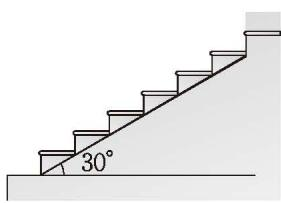  
(第1题)

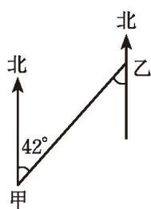  
(第2题)

2. 如图, 在甲、乙两地之间要修一条笔直的公路, 从甲地测得公路的走向是北偏东 $42^{\circ}$ 。甲、乙两地同时开工, 若干天后公路准确接通。从乙地测, 所修公路的走向是南偏西多少度? 为什么?

(1)

3. 如图, 点 $D$ 是线段 ${BC}$ 上的一点, 请用尺规过点 $D$ 作直线 ${EF}$ , ${MN}$ ,使 ${EF}//{AB},{MN}//{AC}$ ,并判断 ${EF}$ 和 ${MN}$ 相交所成的锐角与 $\angle A$ 的数量关系。

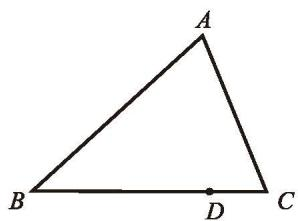  
(第3题)

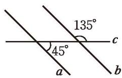

(第4题)  
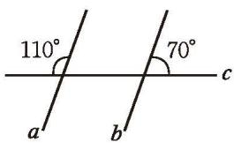  
(2)

4. 如图，直线 a 与直线 b 平行吗？请说明理由。

5. 在下列各图中， $a \parallel b$ ，分别计算 $\angle 1$ 的度数。

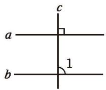

(1)

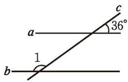  
(第5题)

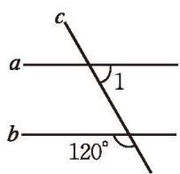  
(3)

6. 意大利的比萨斜塔始建于 1174 年，1350 年完成。因奠基不慎，致塔身倾斜。目前，它与地面所成的较小的角为 $85^{\circ}$ （如图所示），它与地面所成的较大的角是多少度？为什么？

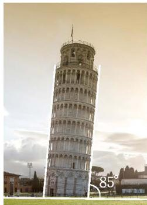  
(第6题)

##### > 数学理解

7. 如图, 如果 $\angle B$ 与 $\angle C$ 互补, 那么哪两条直线平行? $\angle A$ 与哪个角互补, 可以保证 $A D / / B C$ ?

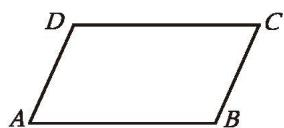  
(第7题)

8. 直线 a, b, c, d 如图所示。

(1) 如果 $a \parallel b$ , 那么图中有哪些相等的角和互补的角?

(2) 要使 $c \parallel d$ , 需要哪两个角相等?

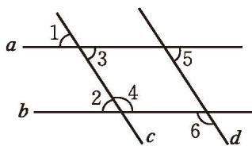  
(第8题)

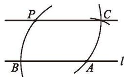  
(第9题)

※9. 如图, 已知点 $P$ 在直线 $l$ 外, 利用如下方法也可以作出过点 $P$ 与直线 $l$ 平行的直线:

在直线 l 上任取一点 A，以点 A 为圆心，以 AP 的长为半径作弧，交直线 l 于点 B；以点 P 为圆心，以 PA 的长为半径作弧；以点 A 为圆心，以 PB 的长为半径作弧，交前弧于点 C；作直线 PC，则 $PC \parallel l$ 。

(1)这种作法用到了哪些你学过的基本尺规作图?(提示:连接 $PA$ )

(2) 如何说明这种作法的道理？

(3) 连接 $PB, AC$ , 在图中能发现你熟悉的图形吗?

##### > 问题解决

10. 如图, 一条公路两次拐弯后, 和原来的方向相同, 第一次拐的角 $\angle B = 140^{\circ}$ , 第二次拐的角 $\angle C$ 是多少度?

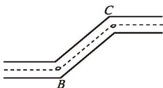  
(第10题)

11. 一个人从 $A$ 点出发沿北偏东 $60^{\circ}$ 方向走到 $B$ 点, 再从 $B$ 点出发沿南偏西 $20^{\circ}$ 方向走到 $C$ 点, 那么 $\angle ABC$ 是多少度?

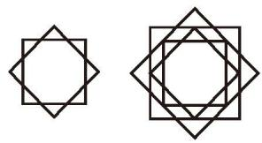

12. 如图所示, 选择适当的方向击打白球, 可以使白球反弹后将红球撞入袋中, 此时 $\angle 1 = \angle 2$ , 并且 $\angle 2 + \angle 3 = 90^{\circ}$ 。如果 $\angle 3 = 30^{\circ}$ , 那么 $\angle 1$ 应等于多少度, 才能保证红球直接入袋?

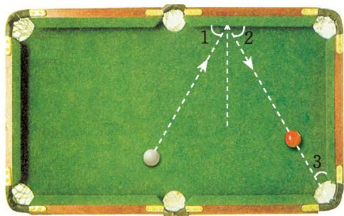  
(第12题)

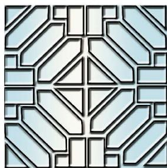  
(第13题)

13. 如图所示的是河南社旗县清代山陕会馆中的窗棂图案的一部分。其中有哪些平行的线？请你设计一种类似的窗棂图案。

※14. 从下面的第一个图出发，通过不断地作平行线，你就能得到一个美丽的图案。请你试一试。

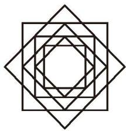  
(第14题)

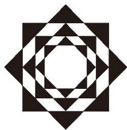

##### 联系拓广

※15. 适当地剪几刀，可以把图中的十字形变成一个正方形，有人说剪两刀就可以，你相信吗？不妨试试看。

16. 结合你的学习经验谈一谈观察、操作、推理、交流等方法在研究几何图形过程中的作用。

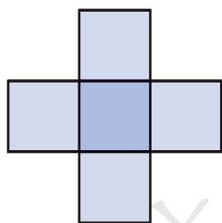  
(第15题)
