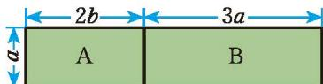

> [!question] 探究引入
> 1. 如图 1-4，在计算操场面积的问题中，如何计算 A 和 B 组成的长方形区域的面积？你是怎么计算的？
> 
> 

>   
>    
>   
图 1-4

> 

> 
> 2. 小明认为，这个长方形的面积既可以表示为 $a (2 b + 3 a)$，也可以表示为 $2 a b + 3 a^{2}$，于是 $a (2 b + 3 a) = 2 a b + 3 a^{2}$。你能用运算律解释吗？
> 
> > [!success]- 解析
> > 1. 既可以直接用大长方形的长乘宽表示为 $a(2b+3a)$，也可以用小长方形 A 和 B 的面积和表示为 $a \cdot 3a + a \cdot 2b = 3a^2 + 2ab$。
> > 2. 可以使用**乘法分配律**来解释：$a(2b + 3a) = a \cdot 2b + a \cdot 3a = 2ab + 3a^2$。

 你能计算 $ab \cdot (abc + 2x)$ ，$c^2 \cdot (m + n - p)$ ，$(x^2y + xy^2) \cdot (-xy)$ 吗？  

> [!todo] 操作·交流
> 1. 一般地，如何进行单项式乘多项式的运算？与同伴进行交流。
> 
> > [!summary]- [单项式乘多项式法则](课本/【2024版】【北师大版】/单项式乘多项式法则.md)
> > **单项式与多项式相乘，就是根据分配律用单项式乘多项式的每一项，再把所得的积相加。**

> [!example]- 例 2
> 计算：  
> 1. $2ab(5ab^{2}+3a^{2}b)$  
> 2. $\left(\frac{2}{3}ab^{2}-2ab\right)\cdot\frac{1}{2}ab$  
> 3. $5m^{2}n(2n+3m-n^{2})$  
> 4. $2(x+y^{2}z+xy^{2}z^{3})\cdot xyz$
> 
> > [!success]- 解
> > 1. 
> > $$
> > \begin{aligned}
> > 2ab(5ab^{2}+3a^{2}b) &= 2ab\cdot5ab^{2}+2ab\cdot3a^{2}b \\
> > &= 10a^{2}b^{3}+6a^{3}b^{2}
> > \end{aligned}
> > $$
> > 
> > 2. 
> > $$
> > \begin{aligned}
> > \left(\frac{2}{3} ab^2 - 2ab\right) \cdot \frac{1}{2} ab &= \frac{2}{3} ab^2 \cdot \frac{1}{2} ab + (-2ab) \cdot \frac{1}{2} ab \\
> > &= \frac{1}{3} a^2 b^3 - a^2 b^2
> > \end{aligned}
> > $$
> > 
> > 3. 
> > $$
> > \begin{aligned}
> > 5m^{2}n(2n + 3m - n^{2}) &= 5m^{2}n\cdot 2n + 5m^{2}n\cdot 3m + 5m^{2}n\cdot (-n^{2}) \\
> > &= 10m^{2}n^{2} + 15m^{3}n - 5m^{2}n^{3}
> > \end{aligned}
> > $$
> > 
> > 4. 
> > $$
> > \begin{aligned}
> > 2(x + y^{2}z + xy^{2}z^{3})\cdot xyz &= (2x + 2y^{2}z + 2xy^{2}z^{3})\cdot xyz \\
> > &= 2x\cdot xyz + 2y^{2}z\cdot xyz + 2xy^{2}z^{3}\cdot xyz \\
> > &= 2x^{2}yz + 2xy^{3}z^{2} + 2x^{2}y^{3}z^{4}
> > \end{aligned}
> > $$
