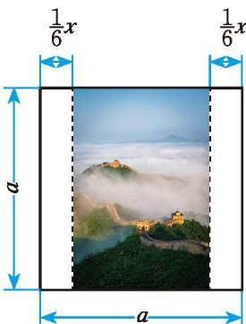
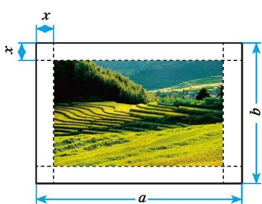

> [!question] 尝试·交流
> 1. 如何计算 $(2a + b)(a + 2b)$, $(x + y)(x - 1)$, $(a^2 - b^2)(a - b)$ ？你是怎么做的？  
> 2. 一般地，如何进行多项式乘多项式的运算？与同伴进行交流。
> 
> > [!summary]- [多项式乘多项式法则](课本/【2024版】【北师大版】/多项式乘多项式法则.md)
> > **多项式与多项式相乘，先用一个多项式的每一项乘另一个多项式的每一项，再把所得的积相加。**

> [!example]- 例 3
> 计算：  
> 3. $(1 - x)(0.6 - x)$  
> 4. $(2x + y)(x - y)$
> 
> > [!success]- 解
> > 1. $(1 - x)(0.6 - x) = 1\times 0.6 - 1\cdot x - x\cdot 0.6 + x\cdot x = 0.6 - x - 0.6x + x^2 = 0.6 - 1.6x + x^2$  
> > 2. $(2x + y)(x - y) = 2x\cdot x - 2x\cdot y + y\cdot x - y\cdot y = 2x^{2} - 2xy + xy - y^{2} = 2x^{2} - xy - y^{2}$

> [!observe] 观察·思考
> 5. 如图 1-5，一幅边长为 $a\text{ m}$ 的正方形风景画，左右各留有宽为 $\frac{1}{6} x\text{ m}$ 的长方形空白区域作装饰，中间画面的面积是多少平方米？
> 6. 如图 1-6，一幅长为 $a\text{ m}$、宽为 $b\text{ m}$ 的长方形风景画，画面的四周留有空白区域作装饰，其中四角均是边长为 $x\text{ m}$ 的正方形，正中间画面的面积是多少平方米？
> 
> 

>   

>     

>       
>       
图 1-5

>     

>     

>       
>       
图 1-6

>     

>   

> 

> 
> > [!success]- 解析
> > 1. 中间长方形的长为 $a\text{ m}$，宽为 $\left(a - \frac{2}{6}x\right)\text{ m}$，面积为：$a\left(a - \frac{1}{3}x\right) = a^2 - \frac{1}{3}ax\text{ (m}^2\text{)}$。
> > 2. 正中间画面的长为 $(a - 2x)\text{ m}$，宽为 $(b - 2x)\text{ m}$，面积为：$(a - 2x)(b - 2x) = ab - 2ax - 2bx + 4x^2\text{ (m}^2\text{)}$。

> [!note] 随堂练习
> 7. 计算：  
>    (1) $a(a^{2}m + n)$  
>    (2) $b^{2}(b+3a-a^{2})$  
>    (3) $x^{3}y(\frac{1}{2} xy^{3} - 1)$  
>    (4) $4(e+f^{2}d)\cdot ef^{2}d$
> 8. 计算：  
>    (1) $(x + y)(a + 2b)$  
>    (2) $(2a + 3)\left(\frac{3}{2} b + 5\right)$  
>    (3) $(2x + 3)(-x - 1)$
> 
> > [!success]- 参考答案
> > **第 1 题：** > > (1) $a^3m + an$  
> > (2) $b^3 + 3ab^2 - a^2b^2$  
> > (3) $\frac{1}{2}x^4y^4 - x^3y$  
> > (4) $4e^2f^2d + 4ef^4d^2$  
> > **第 2 题：** > > (1) $ax + 2bx + ay + 2by$  
> > (2) $3ab + 10a + \frac{9}{2}b + 15$  
> > (3) $-2x^2 - 5x - 3$
