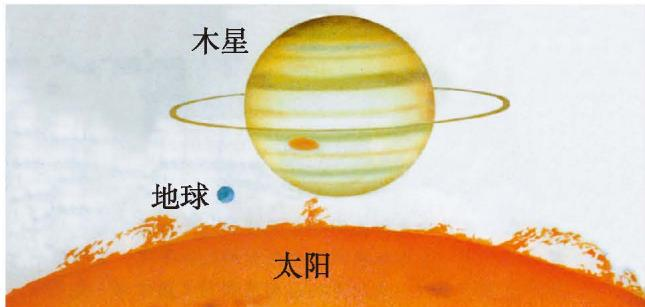

> [!info] 情境引入：天体体积问题
> 如图 1-1，地球、木星、太阳可以近似地看成球体。木星、太阳的半径分别约为地球的 10 倍和 $10^{2}$ 倍，它们的体积分别约为地球的多少倍？[^1]
> 💡 球的体积公式是 $V=\frac{4}{3}\pi r^{3}$，其中 $V$ 是球的体积，$r$ 是球的半径。
> 
> 

>   
>    
>   
图 1-1

> 

> 
> * 木星的半径约为地球的 10 倍，它的体积约为地球的 $10^{3}$ 倍。
> * 太阳的半径约为地球的 $10^{2}$ 倍，它的体积约为地球的 $(10^{2})^{3}$ 倍。

 **那么，你知道 $(10^{2})^{3}$ 等于多少吗？**

> [!question] 尝试·思考
> 1. 计算下列各式，并说明理由。  
>    (1) $(6^{2})^{4}$ ; (2) $(a^{2})^{3}$ ; (3) $(a^{m})^{2}$ 。
> 2. 如果 $m, n$ 都是正整数，那么 $(a^{m})^{n}$ 等于什么？为什么？
> 
> > [!success]- 解析与答案
> > 1. **计算与理由：**
> >    * (1) $(6^{2})^{4} = 6^{2} \times 6^{2} \times 6^{2} \times 6^{2} = 6^{2+2+2+2} = 6^{8}$（依据同底数幂的乘法法则）。
> >    * (2) $(a^{2})^{3} = a^{2} \times a^{2} \times a^{2} = a^{2+2+2} = a^{6}$。
> >    * (3) $(a^{m})^{2} = a^{m} \times a^{m} = a^{m+m} = a^{2m}$。
> > 2. **一般性推导：**
> >    * $(a^{m})^{n} = a^{mn}$。理由见下方法则推导。
> 
> > [!summary]- [幂的乘方公式](课本/【2024版】【北师大版】/【2024版】【北师大版】七年级下册数学/幂的乘方公式.md)
> > $$
> > (a ^ {m}) ^ {n} = \overbrace {a ^ {m} \cdot a ^ {m} \cdot \cdots \cdot a ^ {m}} ^ {n \text { 个 } a ^ {m}} = \overbrace {a ^ {m + m + \cdots + m}} ^ {n \text { 个 } m} = a ^ {m n}
> > $$
> > 即：
> > $(a^{m})^{n} = a^{mn}$ （$m, n$ 都是正整数）。
> > 
> > **幂的乘方，底数不变，指数相乘。**

> [!example]- 例 3
> 计算：  
> 1. $(10^{2})^{3}$  
> 2. $(b^{5})^{5}$  
> 3. $(a^{n})^{3}$  
> 4. $-(x^{2})^{m}$  
> 5. $(y^{2})^{3}\cdot y$  
> 6. $2(a^{2})^{6}-(a^{3})^{4}$
> 
> > [!success]- 解
> > 1. $(10^{2})^{3}=10^{2\times3}=10^{6}$  
> > 2. $(b^{5})^{5}=b^{5\times5}=b^{25}$  
> > 3. $(a^{n})^{3}=a^{n\cdot3}=a^{3n}$  
> > 4. $-(x^{2})^{m}=-x^{2\cdot m}=-x^{2m}$  
> > 5. $(y^{2})^{3} \cdot y = y^{2 \times 3} \cdot y = y^{6} \cdot y = y^{7}$  
> > 6. $2(a^{2})^{6} - (a^{3})^{4} = 2a^{2\times 6} - a^{3\times 4} = 2a^{12} - a^{12} = a^{12}$

##### 随堂练习

1. 计算：  
(1) $(10^{3})^{3}$ ; (2) $-(a^{2})^{5}$ ; (3) $(x^{3})^{4}\cdot x^{2}$ 。

2. 已知 $x^{n} = 2$ ，求 $x^{2n}$ 的值。

[^1]: 💡 **已知背景：** 球的体积公式是 $V=\frac{4}{3}\pi r^{3}$，其中 $V$ 是球的体积，$r$ 是球的半径。
