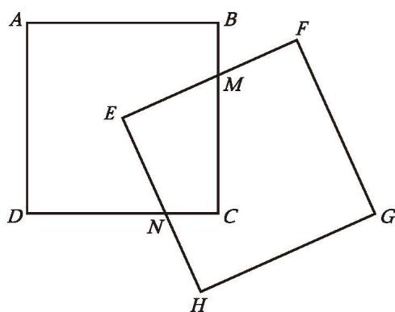
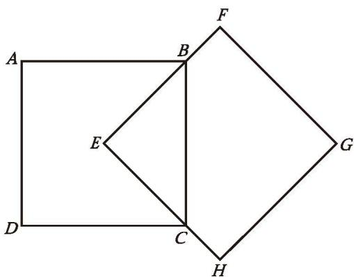
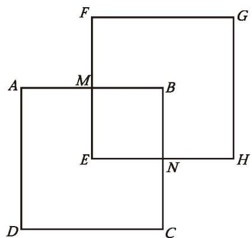
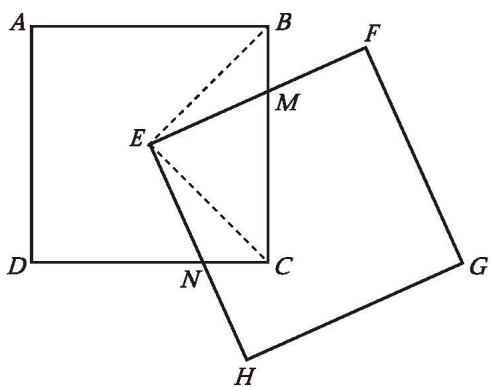
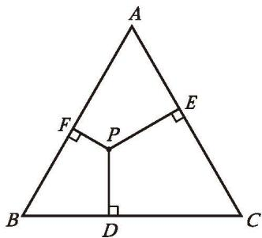
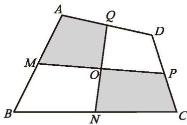

### ☆ 问题解决策略：特殊化

面对一般性的问题时，可以先考虑特殊情形，借助特殊情形下获得的结论或方法解决一般性的问题，这就是特殊化策略。特殊情形下，问题变得具体、简单、易于解决；同时，它与一般性问题关系密切，特殊问题的解决经验有可能推广到一般性问题的解决中。因此，从特殊情形出发，有助于我们发现解决问题的思路。

问题 如图 4-34，有两个边长为 1 的正方形，其中正方形 EFGH 的顶点 E 与正方形 ABCD 的中心重合。在正方形 EFGH 绕点 E 旋转的过程中，两个正方形重叠部分的面积是多少？

##### 理解问题

(1) 在旋转过程中，两个正方形的重叠部分会呈现出哪些情形？

  
   
  图4-34

(2) 对于这些不同情形，如何求两个正方形重叠部分的面积？你遇到的困难是什么？

##### 拟订计划

(1) 哪些特殊情形下，两个正方形重叠部分的面积容易求出？
(2) 其他情形能转化为容易求解的特殊情形吗？

##### 实施计划

写出你的解决方案，并说明道理。

小明的思考过程如下。
(1) 先考虑特殊情形。如图 4-35、图 4-36，这两种情形下，重叠部分的面积容易求出，都是 $\frac{1}{4}$ 。

|  |  |
| :---: | :---: |
|  |  |
| 图4-35 | 图4-36 |

（2）将一般情形转化为特殊情形。如图4-37，连接 $EB$ ， $EC$ 。两个正方形重叠部分的面积记作 $S_{\text{重叠}}$ ，则 $S_{\text{重叠}} = S_{\triangle BEC} + S_{\triangle CEN} - S_{\triangle BEM}$ 。可以发现， $\triangle BEM \cong \triangle CEN$ ，这时，图4-37的情形就转化为图4-35的情形， $S_{\text{重叠}} = S_{\triangle BEC} = \frac{1}{4}$ 。因此，一般情形下，重叠部分的面积也是 $\frac{1}{4}$ 。

  
   
  图4-37

##### 回顾反思

(1) 回顾本题的解决过程，你有哪些感悟？
(2) 具有什么特点的问题，可以从特殊情形入手？如何寻找特殊情形？与同伴进行交流。

在这个问题中，正方形 EFGH 的位置是变化的，所求重叠部分的面积有很多情形，因此，小明尝试从特殊情形入手，并借助特殊情形的经验解决了一般情形下的问题。因为某些因素（如形状、位置或数值等）不确定，使得问题有多种情形时，可以限制这个引起变化的因素，考虑最为特殊的情形，采用从特殊情形入手的策略解决问题。

请用特殊化策略解答下列问题。

1. 如图 4-38，点 $P$ 是等边三角形 $ABC$ 内的任意一点，过点 $P$ 向三边作垂线，垂足分别为 $D, E, F$ 。小颖从特殊情形入手，认为 $AF + BD + CE$ 等于 $\triangle ABC$ 周长的 $\frac{1}{2}$ 。你知道她是怎么做的吗？

|                                                                                                   |                                                                                                   |
| :-----------------------------------------------------------------------------------------------: | :-----------------------------------------------------------------------------------------------: |
|  |  |
|                                               图4-38                                               |                                               图4-39                                               |

2. 如图 4-39，四边形 $ABCD$ 的面积是 16，各边中点分别为 $M, N, P, Q, MP$ 与 $NQ$ 相交于点 $O$ ，求图中阴影部分的总面积。

3. 甲、乙两人轮流在一张圆桌上放置同样大小的硬币，每人每次只能放置一枚硬币，且放置过程中不允许重叠与倾斜，硬币不能超出桌面的边界。规定谁在桌上放下最后一枚硬币，谁就获胜。你知道获胜的策略吗？

4. 一个三位数除以它的各位数字之和，商最大是多少？

