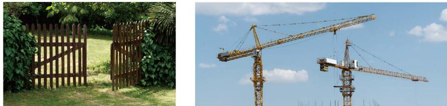

由上面的结论可知，只要三角形三边的长度确定了，这个三角形的形状和大小就完全确定了。图 4-22 是用三根木条钉成的一个三角形框架，它的大小和形状是固定不变的。三角形的这个性质叫作[三角形的稳定性](课本/【2024版】【北师大版】/【2024版】【北师大版】七年级下册数学/概念/三角形的稳定性.md)。
图 4-23 是用四根木条钉成的一个框架，它的形状是可以改变的，因此，四边形具有不稳定性。

  
  
   
  
图 4-22 &emsp;&emsp;&emsp;&emsp;&emsp;&emsp;&emsp;&emsp;&emsp;&emsp;&emsp;&emsp;&emsp;&emsp;&emsp;&emsp; 图 4-23

在生活中，我们经常会看到应用三角形稳定性的例子（如图 4-24）。

  
   
  
图 4-24

