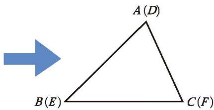

# 全等三角形

能够完全重合的两个三角形叫作**全等三角形**。
例如，在图 4-19 中， $\triangle ABC$ 与 $\triangle DEF$ 能够完全重合，它们是全等三角形。其中，顶点 $A$ 与顶点 $D$ 重合，它们是对应顶点；边 $AB$ 与边 $DE$ 重合，它们是对应边； $\angle A$ 与 $\angle D$ 重合，它们是对应角。

  
  
  
   
  

    图 4-19
  

全等三角形的对应边相等、对应角相等。

记两个三角形全等时，通常把表示对应顶点的字母写在对应的位置上。
