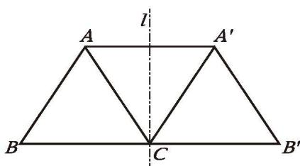

如果一个平面图形沿一条直线折叠后，直线两旁的部分能够互相重合，那么这个图形叫作[轴对称图形](概念/轴对称图形.md)，这条直线叫作[对称轴](概念/对称轴.md)（axis of symmetry）。
图 5-2 是一个轴对称图形，直线 l 是它的对称轴，沿对称轴折叠后，点 A 与点 $A'$ 重合，称点 A 关于对称轴的对应点是点 $A'$ 。类似地，线段 AB 关于对称轴的对应线段是线段 $A'B'$ ，∠B 关于对称轴的对应角是 ∠B'。

  
   
  图5-2

