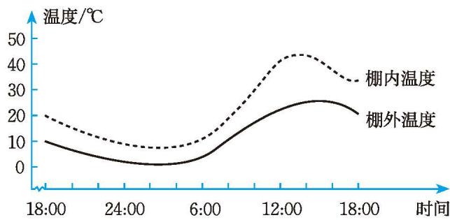

## 1 现实中的变量

汽车刹车时，其制动装置开始发挥作用的瞬间车速称为制动初速度；汽车从开始制动到完全停止所驶过的距离称为制动距离。

1. 这个情境中有哪些量？
2. 随着车辆制动初速度的变化，其他量会发生变化吗？
3. 下表呈现了一辆汽车在某种路面情况下的部分刹车实验数据，你能描述制动距离随制动初速度的变化而变化的情况吗？

| 制动初速度 $v$/(km/h) | 20 | 30 | 40 | 50 | 60 | 70 | 80 | 90 | 100 | 110 | 120 | 130 | 140 |
| :---: | :---: | :---: | :---: | :---: | :---: | :---: | :---: | :---: | :---: | :---: | :---: | :---: | :---: |
| 制动距离 $s$/m | 1.40 | 3.60 | 6.42 | 9.96 | 14.79 | 19.59 | 25.58 | 32.37 | 39.98 | 48.37 | 57.57 | 67.65 | 78.36 |

> [!question] 尝试·交流
>
> 1. 某海域海水的压强 $p$ (单位: Pa) 与水深 $h$ (单位: m) 之间的关系满足：$p = 9.8 \rho h$ (其中 $\rho$ 为海水的密度，通常为 $1.03 \times 10^{3} \mathrm{~kg} / \mathrm{m}^{3}$)。
>    (1) 这个情境中有哪些量？
>    (2) 随着水深 $h$ 的变化，其他量会发生变化吗？
>
> 2. 图 6-1 反映了一个蔬菜大棚某日 18:00 到次日 18:00 棚内温度和棚外温度的变化情况。
>
> 

>   
>    
>   图 6-1
> 

>
> (1) 这个情境中有哪些量？
> (2) 你能描述这个蔬菜大棚棚内温度随时间的变化而变化的情况吗？棚外温度呢？
> (3) 你还有哪些发现？与同伴进行交流。

上面情境中有许多变化的量，如制动距离、制动初速度、海水的压强、水深、棚内温度、棚外温度、时间等，它们都是[变量](概念/变量.md)（variable）。其中，制动距离随制动初速度的变化而变化，海水的压强随水深的变化而变化，棚内温度、棚外温度随时间的变化而变化，制动初速度、水深、时间称为[自变量](概念/自变量.md)（independent variable），制动距离、海水的压强、棚内温度、棚外温度称为[因变量](概念/因变量.md)（dependent variable）。

一定海域内，在海水的压强随水深变化而变化的过程中，海水的密度保持不变。像这种在变化过程中数值始终不变的量称为[常量](概念/常量.md)（constant）。

> [!question] 思考·交流
>
> 举出生活中包含变量的例子，描述变量之间的关系，并与同伴进行交流。

---

##### 随堂练习

1. 下列情境中有哪些变量？其中，哪个是自变量，哪个是因变量？
   (1) 地表以下岩层的温度 $y$ (单位：${}^{\circ}\mathrm{C}$) 随所处深度 $x$ (单位：$\mathrm{km}$) 的变化而变化，在某地 $y$ 与 $x$ 之间的关系可以近似地表示为 $y = 35x + 20$。
   (2) 根据全国人口普查结果，1982—2020 年全国总人口的变化情况如下（精确到 0.01 亿人）：

   | 年份 | 1982 | 1990 | 2000 | 2010 | 2020 |
   | :---: | :---: | :---: | :---: | :---: | :---: |
   | 人口 / 亿人 | 10.32 | 11.60 | 12.95 | 13.71 | 14.43 |

---

[习题 6.1现实中的变量](课本/【2024版】【北师大版】/【2024版】【北师大版】七年级下册数学/习题/习题%206.1现实中的变量.md)