## 1 轴对称及其性质

观察图 5-1 中的图片和图形，它们有什么共同特点？你还能举出一些类似的例子吗？与同伴进行交流。

  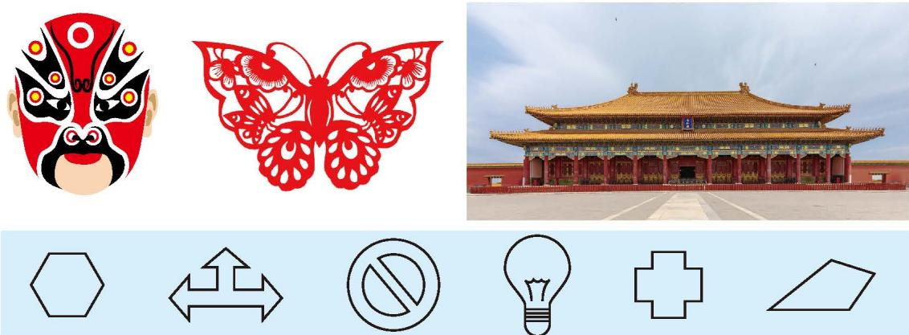
   
  图5-1

如果一个平面图形沿一条直线折叠后，直线两旁的部分能够互相重合，那么这个图形叫作[轴对称图形](概念/轴对称图形.md)，这条直线叫作[对称轴](概念/对称轴.md)（axis of symmetry）。

图 5-2 是一个轴对称图形，直线 l 是它的对称轴，沿对称轴折叠后，点 A 与点 $A'$ 重合，称点 A 关于对称轴的对应点是点 $A'$ 。类似地，线段 AB 关于对称轴的对应线段是线段 $A'B'$ ，∠B 关于对称轴的对应角是 ∠B'。

  
   
  图5-2

你还能在图 5-2 中找出其他的对应点、对应线段和对应角吗？

> [!question] 观察·思考
> 图 5-3 是一个轴对称图形，直线 l 是它的对称轴。观察这个图形，回答下列问题：
> (1) 在图中任意选一组对应线段，这两条线段之间有什么关系？为什么？
> (2) 在图中任意选一组对应角，这两个角之间有什么关系？说说你的理由。
> (3) 连接对应点 $A$ 与 $A'$ ，线段 $AA'$ 与对称轴之间有什么关系？连接其他任意一组对应点再试一试。
> 
> 

>   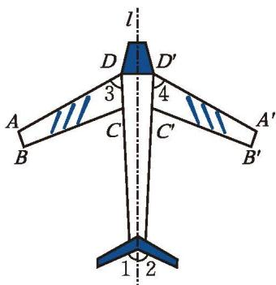
>    
>   
图 5-3

> 

> [!question] 观察·交流
> 观察图 5-4 中的每组图案，你发现了什么？与同伴进行交流。
> 
> 

>   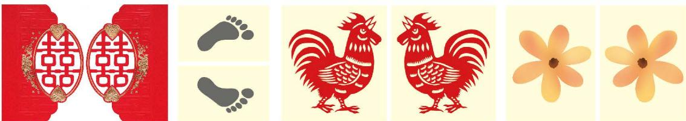
>    
>   
图 5-4

> 

> 
> >> [!success]- [成轴对称](概念/成轴对称.md)
> >> 如果两个平面图形沿一条直线折叠后能够完全重合，那么称这两个图形[成轴对称](概念/成轴对称.md)，这条直线叫作这两个图形的对称轴。

> [!question] 思考·交流
> 如图 5-5，将一张长方形纸对折，然后用笔尖扎出数字"14"，再将纸打开后铺平。
> 
> 

>   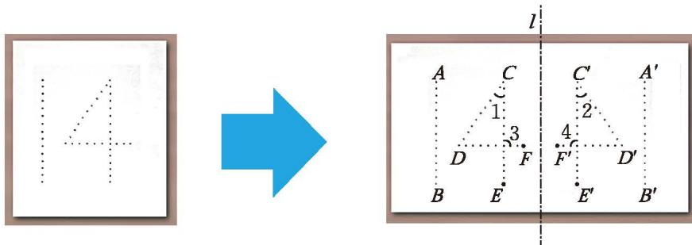
>    
>   
图 5-5

> 

> 
> 在铺平的图中：
> (1) 两个"14"之间有什么关系？
> (2) 对应线段之间有什么关系？对应角之间有什么关系？连接对应点的线段与对称轴 $l$ 之间有什么关系？请举例说明，并与同伴进行交流。
> 
> >> [!success]- 思考结论
> >> 在轴对称图形或两个成轴对称的图形中，对应点所连的线段被对称轴垂直平分，对应线段相等，对应角相等。

在轴对称图形或两个成轴对称的图形中，对应点所连的线段被对称轴垂直平分，对应线段相等，对应角相等。

> [!example]- 例
> 图 5-6 是一个轴对称图形的一半，直线 MN 是这个轴对称图形的对称轴，请画出这个图形的另一半。
> 
> 

>   
>   
>    
>   
图 5-6 &emsp;&emsp;&emsp;&emsp;&emsp;&emsp;&emsp;&emsp; 图 5-7

> 

> 
> >> [!success]- 解
> >> 如图 5-7，延长 $AO$ 至 $A'$ ，使 $OA' = OA$ ；延长 $BN$ 至 $B'$ ，使 $NB' = NB$ ；依次连接 $MA'$ ， $MB'$ ， $A'B'$ ， $A'P$ ， $B'P$ 。这样画出的图形就是这个图形的另一半。

---

##### 随堂练习

1. 下面的图形都是轴对称图形或成轴对称的图形，请分别找出它们的对称轴。

  

    
    
    
    
    
    
  

  

    
    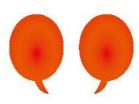
    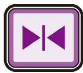
    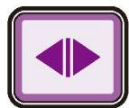
    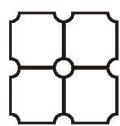
  

  

    （第1题）
  

2. 用笔尖扎对折的纸可以得到下面成轴对称的两个图案。

  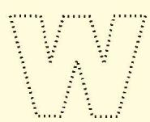
  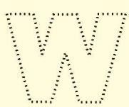
   
  (第2题)

(1) 找出它的两组对应点、两条对应线段和两个对应角；
(2) 说明你找到的对应点所连线段分别被对称轴垂直平分。

3. 分别以图中直线 l 为对称轴，画出图形的另一半。先想一想，再画一画。

  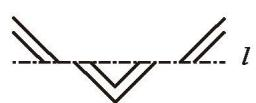
  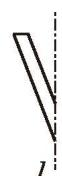
  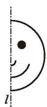
   
  

    （第3题）
  

---
[习题5.1轴对称及其性质](课本/【2024版】【北师大版】/【2024版】【北师大版】七年级下册数学/习题/习题5.1轴对称及其性质.md)

## 1 轴对称及其性质

观察图 5-1 中的图片和图形，它们有什么共同特点？你还能举出一些类似的例子吗？与同伴进行交流。

|  |
| :----------------------------------------------------------------------------------------------------: |
|                                                  图5-1                                                  |

如果一个平面图形沿一条直线折叠后，直线两旁的部分能够互相重合，那么这个图形叫作[轴对称图形](%E6%A6%82%E5%BF%B5/%E8%BD%B4%E5%AF%B9%E7%A7%B0%E5%9B%BE%E5%BD%A2.md)，这条直线叫作[对称轴](%E6%A6%82%E5%BF%B5/%E5%AF%B9%E7%A7%B0%E8%BD%B4.md)（axis of symmetry）。

图 5-2 是一个轴对称图形，直线 l 是它的对称轴，沿对称轴折叠后，点 A 与点 $A'$ 重合，称点 A 关于对称轴的对应点是点 $A'$ 。类似地，线段 AB 关于对称轴的对应线段是线段 $A'B'$ ，∠B 关于对称轴的对应角是 ∠B'。

||
|:-:|
|图5-2|

你还能在图 5-2 中找出其他的对应点、对应线段和对应角吗？

> [!question] 观察·思考  
> 图 5-3 是一个轴对称图形，直线 l 是它的对称轴。观察这个图形，回答下列问题：
> 
> (1) 在图中任意选一组对应线段，这两条线段之间有什么关系？为什么？
> 
> (2) 在图中任意选一组对应角，这两个角之间有什么关系？说说你的理由。
> 
> (3) 连接对应点 $A$ 与 $A'$ ，线段 $AA'$ 与对称轴之间有什么关系？连接其他任意一组对应点再试一试。
> 
> ||
> |:-:|
> |图 5-3|

> [!question] 观察·交流  
> 观察图 5-4 中的每组图案，你发现了什么？与同伴进行交流。
> 
> ||
> |:-:|
> |图 5-4|
> 
> > > [!success]- [成轴对称](%E6%A6%82%E5%BF%B5/%E6%88%90%E8%BD%B4%E5%AF%B9%E7%A7%B0.md)  
> > > 如果两个平面图形沿一条直线折叠后能够完全重合，那么称这两个图形[成轴对称](%E6%A6%82%E5%BF%B5/%E6%88%90%E8%BD%B4%E5%AF%B9%E7%A7%B0.md)，这条直线叫作这两个图形的对称轴。

> [!question] 思考·交流  
> 如图 5-5，将一张长方形纸对折，然后用笔尖扎出数字"14"，再将纸打开后铺平。
> 
> ||
> |:-:|
> |图 5-5|
> 
> 在铺平的图中：
> 
> (1) 两个"14"之间有什么关系？
> 
> (2) 对应线段之间有什么关系？对应角之间有什么关系？连接对应点的线段与对称轴 $l$ 之间有什么关系？请举例说明，并与同伴进行交流。
> 
> > > [!success]- 思考结论  
> > > 在轴对称图形或两个成轴对称的图形中，对应点所连的线段被对称轴垂直平分，对应线段相等，对应角相等。

在轴对称图形或两个成轴对称的图形中，对应点所连的线段被对称轴垂直平分，对应线段相等，对应角相等。

> [!example]- 例  
> 图 5-6 是一个轴对称图形的一半，直线 MN 是这个轴对称图形的对称轴，请画出这个图形的另一半。
> 
> |||
> |:-:|:-:|
> |图 5-6|图 5-7|
> 
> > > [!success]- 解  
> > > 如图 5-7，延长 $AO$ 至 $A'$ ，使 $OA' = OA$ ；延长 $BN$ 至 $B'$ ，使 $NB' = NB$ ；依次连接 $MA'$ ， $MB'$ ， $A'B'$ ， $A'P$ ， $B'P$ 。这样画出的图形就是这个图形的另一半。

---

##### 随堂练习

1. 下面的图形都是轴对称图形或成轴对称的图形，请分别找出它们的对称轴。
    

|||||||
|:-:|:-:|:-:|:-:|:-:|:-:|
|||||||
|||（第1题）||||

2. 用笔尖扎对折的纸可以得到下面成轴对称的两个图案。
    

|||
|:-:|:-:|
|||
|colspan|（第2题）|

(1) 找出它的两组对应点、两条对应线段和两个对应角；

(2) 说明你找到的对应点所连线段分别被对称轴垂直平分。

3. 分别以图中直线 l 为对称轴，画出图形的另一半。先想一想，再画一画。
    

||||
|:-:|:-:|:-:|
||（第3题）||

---

[习题5.1轴对称及其性质](%E8%AF%BE%E6%9C%AC/%E3%80%902024%E7%89%88%E3%80%91%E3%80%90%E5%8C%97%E5%B8%88%E5%A4%A7%E7%89%88%E3%80%91/%E3%80%902024%E7%89%88%E3%80%91%E3%80%90%E5%8C%97%E5%B8%88%E5%A4%A7%E7%89%88%E3%80%91%E4%B8%83%E5%B9%B4%E7%BA%A7%E4%B8%8B%E5%86%8C%E6%95%B0%E5%AD%A6/%E4%B9%A0%E9%A2%98/%E4%B9%A0%E9%A2%985.1%E8%BD%B4%E5%AF%B9%E7%A7%B0%E5%8F%8A%E5%85%B6%E6%80%A7%E8%B4%A8.md)
