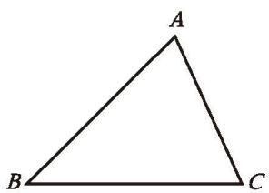
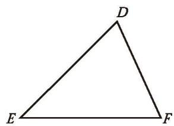
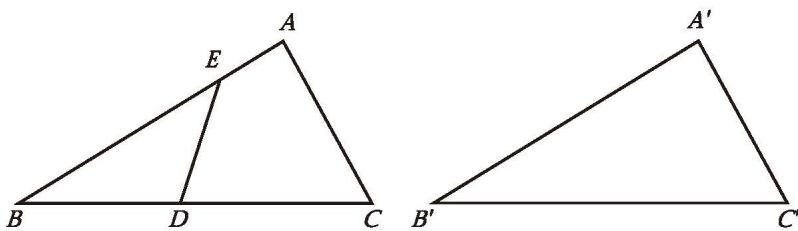

## 2 全等三角形

在生活中，我们会看到完全一样的图形，如果把它们叠在一起，它们就能够完全重合。

能够完全重合的两个三角形叫作[全等三角形](课本/【2024版】【北师大版】/【2024版】【北师大版】七年级下册数学/概念/全等三角形.md)。例如，在图 4-19 中， $\triangle ABC$ 与 $\triangle DEF$ 能够完全重合，它们是全等三角形。其中，顶点 $A$ 与顶点 $D$ 重合，它们是对应顶点；边 $AB$ 与边 $DE$ 重合，它们是对应边； $\angle A$ 与 $\angle D$ 重合，它们是对应角。

  
  
  
   
  

    图 4-19
  

你还能在图 4-19 中找出其他的对应顶点、对应边和对应角吗？

> [!summary] [全等三角形的性质](课本/【2024版】【北师大版】/【2024版】【北师大版】七年级下册数学/知识点/全等三角形的性质.md)
> 全等三角形的对应边相等、对应角相等。

$\triangle ABC$ 与 $\triangle DEF$ 全等，记作 $\triangle ABC \cong \triangle DEF$。记两个三角形全等时，通常把表示对应顶点的字母写在对应的位置上。

---

> [!question] 操作·交流
> (1) 每人准备两张全等三角形纸片，并画出两张三角形纸片对应边的高。全等三角形对应边的高相等吗？对应边的中线呢？对应的角平分线呢？  
> (2) 如图 4-20，已知 $\triangle ABC \cong \triangle A'B'C'$ ，点 $D$ ， $E$ 分别在 $BC$ 边、 $AB$ 边上，请在 $\triangle A'B'C'$ 中画出与线段 $DE$ 相对应的线段。图中有哪些相等的线段、相等的角？与同伴进行交流。
> 
> 

>   
>    
>   
图 4-20

> 

> [!tip] 尝试·交流
> 准备一张等边三角形纸片，你能用折纸的办法把它分成两个全等三角形吗？能把它分成三个全等三角形吗？能把它分成四个全等三角形吗？与同伴进行交流。

---

##### 随堂练习

1. 如图， $\triangle AOD \cong \triangle BOC$ ，写出其中相等的角。

  
  
   
  
(第 1 题) &emsp;&emsp;&emsp;&emsp;&emsp;&emsp;&emsp;&emsp;&emsp;&emsp;&emsp;&emsp;&emsp;&emsp;&emsp;&emsp; (第 2 题)

2. 如图， $\triangle ABC \cong \triangle A'B'C'$ ， $\angle C = 25^{\circ}$ ， $BC = 6 \text{ cm}$ ， $AC = 4 \text{ cm}$ ，你能得出 $\triangle A'B'C'$ 中哪些角的大小、哪些边的长度？

---

[习题 4.2 全等三角形](课本/【2024版】【北师大版】/【2024版】【北师大版】七年级下册数学/习题/习题%204.2%20全等三角形.md)
