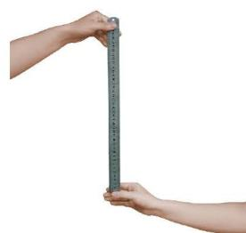

## 2 用表格表示变量之间的关系

你知道自己的反应时间是多少吗？如图 6-2，测试者将一根较长的直尺零刻度朝下，悬在被测试者的大拇指和食指之间，被测试者两个手指间距约 3 cm，与直尺的零刻度保持在同一水平面上。测试者突然放开直尺，被测试者迅速用手指夹住，手指所夹处的直尺刻度就是被测试者的反应距离。不同的反应距离对应不同的反应时间，下表呈现了部分反应距离及对应的反应时间：

  
   
  图 6-2

| 反应距离 /cm | 5 | 6 | 7 | 8 | 9 | 10 | 11 | 12 | 13 | 14 | 15 |
| :---: | :---: | :---: | :---: | :---: | :---: | :---: | :---: | :---: | :---: | :---: | :---: |
| 反应时间 /s | 0.101 | 0.111 | 0.120 | 0.128 | 0.136 | 0.143 | 0.150 | 0.156 | 0.163 | 0.169 | 0.175 |

1. 当反应距离为 $10 \mathrm{~cm}$ 时，反应时间是多少？
2. 反应距离越大的人，其反应时间有什么特点？
3. 反应距离每增加 $1 \mathrm{~cm}$，反应时间的变化情况相同吗？
4. 小明和同桌实验测得的反应距离分别为 $9.5 \mathrm{~cm}$、$18 \mathrm{~cm}$，你能估计他们的反应时间吗？你是怎样估计的？
5. 请你和同桌一起做一做上面的实验，估计自己的反应时间。

> [!question] 观察·思考
>
> 2016—2022 年我国国内生产总值（GDP）[^1]的变化情况如下（精确到 1 万亿元）：
>
> | 年份 | 2016 | 2017 | 2018 | 2019 | 2020 | 2021 | 2022 |
> | :---: | :---: | :---: | :---: | :---: | :---: | :---: | :---: |
> | GDP/万亿元 | 75 | 83 | 92 | 99 | 101 | 115 | 120 |
>
> 1. 如果用 $x$ 表示年份，$y$ 表示我国国内生产总值，那么随着 $x$ 的变化，$y$ 的变化趋势是什么？
>
>
> 2. 2016—2022 年我国国内生产总值是怎样变化的？
> 3. 根据表格，预测 2030 年我国国内生产总值。

借助表格，我们可以表示因变量随自变量的变化而变化的情况。

##### 随堂练习

1. 某农场发现当每公顷钾肥和磷肥的施用量一定时，土豆的产量与氮肥施用量有如下关系：

   | 每公顷氮肥施用量 /kg | 0 | 34 | 67 | 101 | 135 | 202 | 259 | 336 | 404 | 471 |
   | :---: | :---: | :---: | :---: | :---: | :---: | :---: | :---: | :---: | :---: | :---: |
   | 每公顷土豆产量 /t | 15.18 | 21.36 | 25.72 | 32.29 | 34.03 | 39.45 | 43.15 | 43.46 | 40.83 | 30.75 |

   (1) 上表反映了哪两个变量之间的关系？其中，哪个是自变量，哪个是因变量？
   (2) 当每公顷氮肥的施用量是 $101 \mathrm{~kg}$ 时，每公顷土豆的产量是多少？如果不施氮肥呢？
   (3) 根据表格中的数据，你认为每公顷氮肥的施用量是多少时比较适宜？说说你的理由。
   (4) 粗略说一说氮肥的施用量对土豆产量的影响。

---
[习题 6.2用表格表示变量之间的关系](课本/【2024版】【北师大版】/【2024版】【北师大版】七年级下册数学/习题/习题%206.2用表格表示变量之间的关系.md)