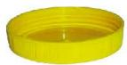
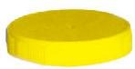

抛一个瓶盖，落地后会出现两种情况（如图 3-2）：

  
  
   
  
盖口向上 &emsp;&emsp;&emsp;&emsp;&emsp;&emsp;&emsp;&emsp; 盖口向下

  
图 3-2

你认为盖口向上和盖口向下的可能性一样大吗？
让我们用试验来验证吧。
[频率的稳定性](课本/【2024版】【北师大版】/【2024版】【北师大版】七年级下册数学/知识点/频率的稳定性.md)

---

掷一枚质地均匀的硬币，硬币落下后，会出现两种情况（如图 3-4）：

  
  
   
  
正面朝上 &emsp;&emsp;&emsp;&emsp;&emsp;&emsp;&emsp;&emsp; 正面朝下

  
图 3-4

你认为正面朝上和正面朝下的可能性相同吗？

[探究事件发生的可能性大小](课本/【2024版】【北师大版】/【2024版】【北师大版】七年级下册数学/知识点/探究事件发生的可能性大小.md)

---

[阅读·思考 概率小史](课本/【2024版】【北师大版】/【2024版】【北师大版】七年级下册数学/趣味阅读/阅读·思考%20概率小史.md)

---

[习题 3.2 频率的稳定性](课本/【2024版】【北师大版】/【2024版】【北师大版】七年级下册数学/习题/习题%203.2%20频率的稳定性.md)