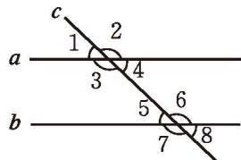

> [!info] 情景引入
> 如图 2-28，直线 $a$ 与直线 $b$ 平行。
> 
> 

>   
>    
>   
图 2-28

> 

> 
> 1. 测量同位角 $\angle 1$ 和 $\angle 5$ 的大小, 它们有什么关系? 图中还有其他同位角吗？它们的大小有什么关系？改变直线 $c$ 与直线 $a$ 所成角的大小再试一试，你能得到相同的结论吗？
> 2. 图中有几对内错角？它们的大小有什么关系？为什么？
> 3. 图中有几对同旁内角？它们的大小有什么关系？为什么？
> 
>> [!summary]- [平行线的性质](课本/【2024版】【北师大版】/【2024版】【北师大版】七年级下册数学/概念/平行线的性质.md)
>> **两条平行直线被第三条直线所截，同位角相等。** 
>> 简述为：**两直线平行，同位角相等。**
>> 
>> **两条平行直线被第三条直线所截，内错角相等。** 
>> 简述为：**两直线平行，内错角相等。**
> >
>> **两条平行直线被第三条直线所截，同旁内角互补。** 
>> 简述为：**两直线平行，同旁内角互补。**

[平行线的性质](课本/【2024版】【北师大版】/【2024版】【北师大版】七年级下册数学/知识点/平行线的性质.md)

---

[平行线的性质的应用](课本/【2024版】【北师大版】/【2024版】【北师大版】七年级下册数学/知识点/平行线的性质的应用.md)

---

[阅读·思考 测量地球的周长](课本/【2024版】【北师大版】/【2024版】【北师大版】七年级下册数学/趣味阅读/阅读·思考%20测量地球的周长.md)

---
[习题 2.3 平行线的性质](课本/【2024版】【北师大版】/【2024版】【北师大版】七年级下册数学/习题/习题%202.3%20平行线的性质.md)