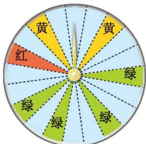

前面我们用事件发生的频率来估计该事件发生的概率，但得到的往往只是概率的估计值。那么，还有没有其他求概率的方法呢？

> [!question] 思考·交流
> 1. 一个袋中装有 5 个球，分别标有 1, 2, 3, 4, 5 这五个号码，这些球除号码外都相同，混合均匀后任意摸出一个球。
>    (1) 会出现哪些可能的结果？
>    (2) 每种结果出现的可能性相同吗？猜一猜它们的概率分别是多少。
> 2. 前面我们提到的掷硬币、掷骰子和摸球的游戏有什么共同的特点？与同伴进行交流。

[等可能事件的概率](课本/【2024版】【北师大版】/【2024版】【北师大版】七年级下册数学/知识点/等可能事件的概率.md)

你还能求哪些事件的概率？

---
> [!question] 辩论与思考 (1)
> 一个袋中装有 2 个红球和 3 个白球，每个球除颜色外都相同，任意摸出一个球，摸到红球的概率是多少？
> 
> |  | 摸出的球不是红球就是白球，所以摸到红球和摸到白球的可能性相同，也就是，$P(\text{摸到红球}) = \frac{1}{2}$。 |
> | :---: | :--- |
> 
> |  | 红球有 2 个，而白球有 3 个。将每一个球都编上号码：1 号球（红色）、2 号球（红色）、3 号球（白色）、4 号球（白色）、5 号球（白色）。摸出每一个球的可能性相同，共有 5 种等可能的结果。摸到红球可能出现的结果为摸出 1 号球或 2 号球，共有 2 种等可能的结果。所以，$P(\text{摸到红球}) = \frac{2}{5}$。 |
> | :---: | :--- |
> 
> 你认为小明和小颖谁说的有道理？
> 
> (2) 小明和小颖一起做游戏。在一个装有 2 个红球和 3 个白球（每个球除颜色外都相同）的袋中任意摸出一个球，摸到红球小明获胜，摸到白球小颖获胜，这个游戏对双方公平吗？在一个双人游戏中，你是怎样理解游戏对双方公平的？与同伴进行交流。

[等可能事件 摸球](课本/【2024版】【北师大版】/【2024版】【北师大版】七年级下册数学/知识点/等可能事件%20摸球.md)

---

某商场为了吸引顾客，设立了一个可以自由转动的转盘，并将转盘等分成 20 个扇形，像图 3-6 那样涂上颜色。商场规定：顾客每购买 100元 商品，就能获得一次转动转盘的机会。如果转盘停止后，指针正好落在红色、黄色或绿色区域，顾客就可以分别获得 100 元、50 元、20 元的购物券。

  
   
  
图 3-6

(1) 自由转动转盘，当转盘停止时，指针落在不同扇形的可能的结果共有多少种？这些结果是等可能的吗？  
(2) 某顾客购物消费 120 元，获得一次转动转盘的机会。他获得 100 元、50 元、20 元购物券的概率分别是多少？他能获得购物券的概率是多少？

[等可能事件 转盘](课本/【2024版】【北师大版】/【2024版】【北师大版】七年级下册数学/知识点/等可能事件%20转盘.md)

---
[习题 3.3 等可能事件的概率](课本/【2024版】【北师大版】/【2024版】【北师大版】七年级下册数学/习题/习题%203.3%20等可能事件的概率.md)