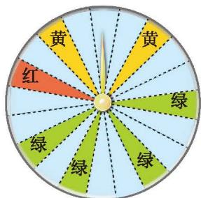
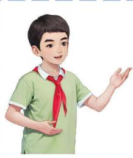

> [!info] 情景引入
> 某商场进行促销活动，设立了一个可以自由转动的转盘（如图 3-1）。活动规则：
> 1. 顾客每购买 100 元商品，就能获得一次转动转盘的机会。
> 2. 自由转动转盘时，转盘要转 1 圈以上才算有效。
> 
> 

>   
>    
>   
图 3-1

> 

> 
> 3. 如果当转盘停止时，指针正好落在红色、黄色、绿色区域，那么顾客就可以分别获得面额 100 元、50 元、20 元的购物券。
> 
> 张阿姨购物消费 110 元，获得一次转动转盘的机会。
> 1. 她一定能获得购物券吗？
> 2. 她能获得面额 10 元的购物券吗？
> 3. 她获得的购物券一定不超过 100 元吗？
> 
>> [!success]- 答
>> 1. 不一定，因为转盘上还有白色区域（无奖区）。
>> 2. 不能，因为转盘奖项中根本没有面额 10 元的购物券。
>> 3. 一定，因为转盘中面额最高的购物券就是 100 元。

在一定条件下进行可重复试验时，有些事件一定会发生，这样的事件称为[必然事件](课本/【2024版】【北师大版】/【2024版】【北师大版】七年级下册数学/概念/必然事件.md)。例如，在上述活动中，"张阿姨获得的购物券不超过 100 元"就是一个必然事件。

在一定条件下进行可重复试验时，有些事件一定不会发生，这样的事件称为[不可能事件](课本/【2024版】【北师大版】/【2024版】【北师大版】七年级下册数学/概念/不可能事件.md)。例如，在上述活动中，"张阿姨获得面额 10 元的购物券"就是一个不可能事件。

在一定条件下进行可重复试验时，有些事件可能发生也可能不发生，这样的事件称为[随机事件](课本/【2024版】【北师大版】/【2024版】【北师大版】七年级下册数学/概念/随机事件.md)。例如，在上述活动中，"张阿姨能获得购物券"就是一个随机事件。

> [!question] 尝试·交流
> 举出生活中的几个必然事件、不可能事件和随机事件，并与同伴进行交流。

---

##### 操作·思考
利用质地均匀的骰子和同伴做游戏，规则如下：
1. 两人同时做游戏，各自掷一枚骰子，每人可以只掷一次骰子，也可以连续地掷几次骰子。
2. 当一人掷出的点数和不超过 10 时，如果决定停止掷，那么此人的得分就是他所掷出的点数和；当一人掷出的点数和超过 10 时，必须停止掷，并且得分为 0。
3. 比较两人的得分，谁的得分高谁就获胜。

多做几次上面的游戏，并将最终结果填入下表。

| 游戏次序 | 游戏者 | 第 1 次点数 | 第 2 次点数 | 第 3 次点数 | ... | 得分 |
| :--- | :--- | :--- | :--- | :--- | :--- | :--- |
| 第一次 | 甲 | | | | ... | |
| 第一次 | 乙 | | | | ... | |
| 第二次 | 甲 | | | | ... | |
| 第二次 | 乙 | | | | ... | |
| 第三次 | 甲 | | | | ... | |
| 第三次 | 乙 | | | | ... | |
| ... | ... | ... | ... | ... | ... | ... |

在做游戏的过程中，如何决定是继续掷骰子还是停止掷骰子？

> [!question] 思考·交流
> 在做游戏的过程中，如果前面掷出的点数和已经是 5，你是决定继续掷还是决定停止掷？如果掷出的点数和已经是 9 呢？
>
>|  | 掷出的点数和已经是 5，根据游戏规则，再掷一次，如果掷出的点数不是 6，那么我的得分就会增加，而掷出的点数不是 6 的可能性要比是 6 的可能性大，所以我决定继续掷。  |
> | :--- | :---: |
> 
> |  | 掷出的点数和已经是 9，再掷一次，如果掷出的点数不是 1，那么我的得分就会变成 0，而掷出的点数是 1 的可能性要比不是 1 的可能性小，所以我决定停止掷。 |
> | :---: | :--- |
> 
> 你认为小明和小颖的说法有道理吗？与同伴进行交流。

**一般地，随机事件发生的可能性是有大有小的。**

---

##### 随堂练习

1. 下列事件中，哪些是必然事件？哪些是不可能事件？哪些是随机事件？
   (1) 买一张彩票，中奖。
   (2) 在 10 个同类产品中，有 9 个合格品、1 个次品。从中一次性任意抽出 2 个进行检验，抽到的都是次品。
   (3) 将花生油滴入水中，油会浮在水面上。

2. 从一副扑克牌中任意抽取一张，这张牌是"A"与这张牌是"黑桃"的可能性哪个大？

3. 生活中有许多随机事件，它们发生的可能性有大有小，请举出几例。

---
[习题 3.1 感受可能性](课本/【2024版】【北师大版】/【2024版】【北师大版】七年级下册数学/习题/习题%203.1%20感受可能性.md)