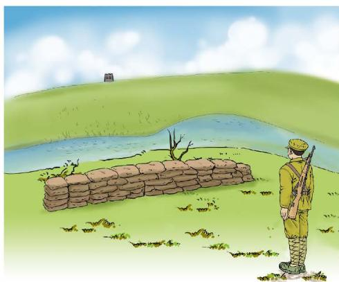
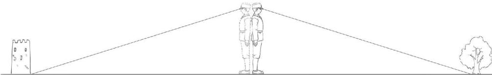
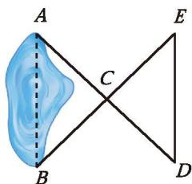
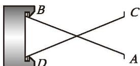

## 4 利用三角形全等测距离

一位经历过战争的老人曾经讲述过这样一个故事：

  
   
  图4-31

在一次战役中，我军阵地与敌军碉堡隔河相望（如图 4-31）。为了炸掉这个碉堡，需要知道碉堡与我军阵地的距离。在不能过河测量又没有任何测量工具的情况下，一名战士想出来这样一个办法：如图 4-32，他面向碉堡的方向站好，调整帽子，使视线通过帽檐正好落在碉堡的底部；然后，他转过一个角度，保持刚才的姿态，这时视线落在了自己所在岸的某一点上；接着，他用步测的方法量出自己与那个点的距离，这个距离就是他与碉堡间的距离。

  
   
  图4-32

(1) 按这名战士的方法，找出教室或操场上与你距离相等的两个点，并通过测量加以验证。
(2) 你能解释其中的道理吗？

> [!question] 观察·思考

如图 4-33，A，B 两点分别位于一个池塘的两端，小丽想用绳子测量 $A$ ， $B$ 间的距离，但绳子不够长，一位叔叔帮她出了这样一个主意：先在地上取一个可以直接到达 $A$ 点和 $B$ 点的点 $C$ ，连接 $AC$ 并延长到 $D$ ，使 $CD = CA$ ；连接 $BC$ 并延长到 $E$ ，使 $CE = CB$ ；连接 $DE$ 并测量出它的长度， $DE$ 的长度就是 $A$ ， $B$ 间的距离。

  
   
  图4-33

你能说明其中的道理吗？

小丽的思考过程如下。

  

在 $\triangle ABC$ 和 $\triangle DEC$ 中，
因为 $AC = DC, \angle ACB = \angle DCE, BC = EC,$ 所以 $\triangle ABC \cong \triangle DEC,$ 所以 $AB = DE$ 。

你能说出小丽每一步的理由吗？

##### 随堂练习

1. 如图，把两根钢条 $AB$ ， $CD$ 的中点连在一起，可以做成一个测量工件内槽宽的工具（卡钳）。只要量得 $AC$ 的长度，就可知工件的内径 $BD$ 是否符合标准。你明白其中的道理吗？与同伴进行交流。

  
   
  (第1题)

[习题 4.4利用三角形全等测距离](课本/【2024版】【北师大版】/【2024版】【北师大版】七年级下册数学/习题/习题%204.4利用三角形全等测距离.md)

---
[问题解决策略：特殊化](课本/【2024版】【北师大版】/【2024版】【北师大版】七年级下册数学/思维/问题解决策略：特殊化.md)