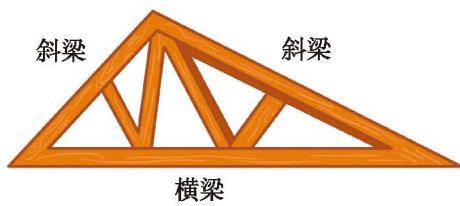
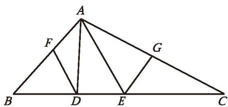
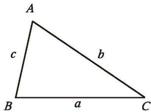
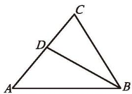
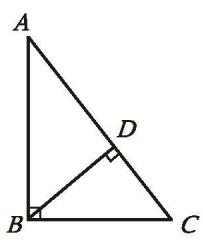
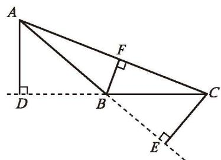

观察图 4-1，回答下列问题：
(1) 你能从图 4-1 中找出几个不同的三角形吗？
(2) 这些三角形有什么共同的特点？

  
   
  
图 4-1

由不在同一直线上的三条线段首尾顺次相接所组成的图形叫作[三角形](课本/【2024版】【北师大版】/【2024版】【北师大版】七年级下册数学/概念/三角形.md)（triangle）。三角形有三条边、三个内角和三个顶点。"三角形"可以用符号"△"表示，如图 4-2 中顶点是 A，B，C 的三角形，记作 △ABC。△ABC 的三边，有时也用 $a，b，c$ 来表示。如图 4-3，顶点 A 所对的边 BC用 $a$ 来表示，边 AC、边 AB 分别用 $b，c$ 来表示。

  
  
   
  
图 4-2 &emsp;&emsp;&emsp;&emsp;&emsp;&emsp;&emsp;&emsp;&emsp;&emsp;&emsp;&emsp;&emsp;&emsp; 图 4-3

---

> [!question] 观察·交流
> 我们知道，将一个三角形的三个角撕下来，拼在一起，可以得到三角形三个内角的和为 $180^{\circ}$。
> 
> 小明只撕下三角形的一个角，也得到了上面的结论，你知道他是如何说明的吗？说说你的想法，并与同伴进行交流。

[探究三角形的内角](课本/【2024版】【北师大版】/【2024版】【北师大版】七年级下册数学/知识点/探究三角形的内角.md)

> [!question] 思考·交流
> (1) 图 4-6 中小明所拿三角形被遮住的两个内角是什么角？小颖的呢？试着说明理由。

[按三角形内角分类](课本/【2024版】【北师大版】/【2024版】【北师大版】七年级下册数学/知识点/按三角形内角分类.md)

---

观察图 4-9 中的三角形，你能发现它们各自的边长之间有什么关系吗？

 
   
   
  
  
    
   
图 4-9

 

 
[探究三角形的三边](课本/【2024版】【北师大版】/【2024版】【北师大版】七年级下册数学/探究三角形的三边.md)

---
如图 4-14，在 $\triangle ABC$ 中，点 $D$ 是 $BC$ 边上的一个动点，连接 $AD$，在点 $D$ 的运动过程中，观察点 $D$ 或线段 $AD$ 有哪些特殊的位置。说说你的想法，并与同伴进行交流。

  
  
   
  
$BE = EC$

  
图 4-14 &emsp;&emsp;&emsp;&emsp;&emsp;&emsp;&emsp;&emsp;&emsp;&emsp;&emsp;&emsp;&emsp;&emsp; 图 4-15

[探究三角形特殊分割线](课本/【2024版】【北师大版】/【2024版】【北师大版】七年级下册数学/知识点/探究三角形特殊分割线.md)

---

##### 随堂练习

1. 如图，在 $\triangle ABC$ 中， $\angle A = 50^{\circ}$ ， $\angle C = 72^{\circ}$ ， $BD$ 是 $\triangle ABC$ 的一条角平分线，求 $\angle ABD$ 的度数。

  
   
  
(第 1 题)

2. 分别指出图中 △ABC 的三条高。

  
  
   
  
(1) &emsp;&emsp;&emsp;&emsp;&emsp;&emsp;&emsp;&emsp;&emsp;&emsp;&emsp;&emsp;&emsp;&emsp; (第 2 题)

[习题4.1认识三角形](课本/【2024版】【北师大版】/【2024版】【北师大版】七年级下册数学/习题/习题4.1认识三角形.md)