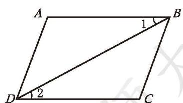
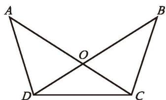
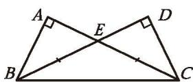

> [!example]- 例 1
> 如图 4-29， $AB \parallel CD$ ，并且 $AB = CD$ ，那么 $\triangle ABD$ 与 $\triangle CDB$ 全等吗？请说明理由。
> 
>> [!success]- 解
>> 因为 $AB \parallel CD$ ，  
>> 根据"两直线平行，内错角相等"，所以 $\angle 1 = \angle 2$ 。
>> 
>> 

>>   
>>    
>>   
图 4-29

>> 

>> 
>> 在 $\triangle ABD$ 和 $\triangle CDB$ 中，  
>> 因为 $AB = CD, \angle 1 = \angle 2, BD = DB,$  
>> 根据三角形全等的判定条件"SAS",  
>> 所以 $\triangle ABD \cong \triangle CDB$ 。

> [!example]- 例 2
> 如图 4-30， $AC$ 与 $BD$ 相交于点 $O$ ，且 $OA = OB$ ， $OC = OD$ 。  
> (1) $\triangle AOD$ 与 $\triangle BOC$ 全等吗？请说明理由。  
> (2) $\triangle ACD$ 与 $\triangle BDC$ 全等吗？为什么？
> 
>> [!success]- 解
>> (1) 因为 $\angle AOD$ 与 $\angle BOC$ 是对顶角，  
>> 根据"对顶角相等"，  
>> 
>> 

>>   
>>    
>>   
图 4-30

>> 

>> 
>> 所以 $\angle AOD = \angle BOC$ 。  
>> 在 $\triangle AOD$ 和 $\triangle BOC$ 中，  
>> 因为 $OA = OB$， $\angle AOD = \angle BOC$ ， $OD = OC$，  
>> 根据三角形全等的判定条件"SAS",  
>> 所以 $\triangle AOD \cong \triangle BOC$ 。  
>> 
>> (2) 由 (1) 可知， $\triangle AOD \cong \triangle BOC$ ，根据"全等三角形的对应边相等"，所以 $AD = BC$ 。因为 $OA = OB$ ， $OC = OD$ ， $AC = OA + OC$ ， $BD = OB + OD$ ，所以 $AC = BD$ 。在 $\triangle ACD$ 和 $\triangle BDC$ 中，因为 $AD = BC$ ， $AC = BD$ ， $DC = CD$ ，根据三角形全等的判定条件"SSS"，所以 $\triangle ACD \cong \triangle BDC$ 。
> 
> 你还能根据其他的判定条件，判断这两个三角形全等吗？

---

> [!question] 回顾·反思
> 说明一个结论正确与否时，需要给出充分的理由，你是如何找到说理思路的？对此你积累了哪些经验？
> 

---

##### 随堂练习

1. 如图， $\angle A$ ， $\angle D$ 为直角， $AC$ 与 $DB$ 相交于点 $E$ ， $BE$ 与 $EC$ 相等，请在图中找出两对全等三角形。

  
   
  
(第 1 题)

