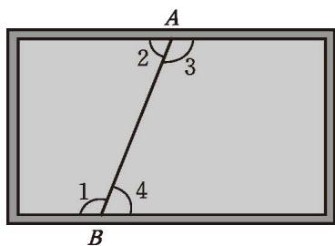
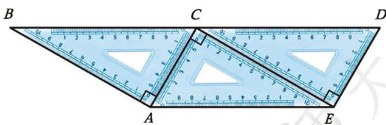
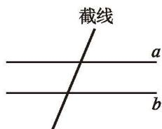
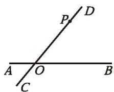
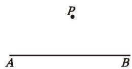
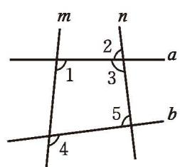

> [!info] 情景引入
> 李老师有一块小画板（如图 2-22），他想知道它的上、下边缘是否平行，于是他在两个边缘之间画了一条线段 $AB$。
>  

>   
>    
>   
图 2-22

> 

>  
> 李老师身边只有一个量角器，他通过测量某些角的大小就能知道这个画板的上、下边缘是否平行，你知道他是怎样做的吗？

如图 2-23，具有 $\angle 1$ 与 $\angle 2$ 这样位置关系的角称为[内错角](课本/【2024版】【北师大版】/【2024版】【北师大版】七年级下册数学/概念/内错角.md)（alternate interior angles）；具有 $\angle 1$ 与 $\angle 3$ 这样位置关系的角称为[同旁内角](课本/【2024版】【北师大版】/【2024版】【北师大版】七年级下册数学/概念/同旁内角.md)（interior angles on the same side）。

  
   
  
图 2-23

在图 2-23 中，找出其他几组内错角和同旁内角。

> [!question] 思考·交流
> 1. 内错角满足什么关系时, 两直线平行? 为什么?  
> 2. 同旁内角满足什么关系时, 两直线平行? 为什么? 与同伴进行交流。
> 
> > [!summary]- 核心结论
> > **两条直线被第三条直线所截，如果内错角相等，那么这两条直线平行。**
> > 简述为：**内错角相等，两直线平行。**
> > 
> > **两条直线被第三条直线所截，如果同旁内角互补，那么这两条直线平行。**
> > 简述为：**同旁内角互补，两直线平行。**

> [!question] 观察·交流
> 1. 如图 2-24, 三个相同的三角尺拼成一个图形, 请找出图中的一组平行线, 并说明你的理由。
> 
> 

>   
>    
>   
图 2-24

> 

> 
> 2. 以下是小颖的思考过程, 你能明白她的意思吗?
> 
|  | $BC$ 与 $AE$ 是平行的。因为 $\angle BCA$ 与 $\angle EAC$ 是内错角，而且相等。 |
| :---: | :--- |
> 
> 3. 在图 2-24 中再找出一组平行线，说说你的理由，并与同伴进行交流。

> [!question] 思考·交流
> 如图 2-25，在探究两条直线是否平行时，常用第三条直线截这两条直线，那么这条截线的作用是什么呢？与同伴进行交流。
> 
> 

>   
>    
>   
图 2-25

> 

> [!question] 尝试·思考
> 如图 2-26，某公园的两条直道 $AB$ 和 $CD$ 交于点 $O$，为方便游客观赏，公园管理部门决定过小路 $CD$ 上的点 $P$，再修建一条直道 $MN$，并且使 $MN$ 与 $AB$ 平行。你能在图中画出直道 $MN$吗？
> 
> 

>   
>    
>   
图 2-26

> 

> 
> 1. 过点 $P$ 的直线有多少条？  
> 2. 满足什么条件的直线才能与 $AB$ 平行？

如图 2-27, 已知点 $P$ 在直线 $AB$ 外, 用尺规作直线 $MN$ , 使 $MN$ 经过点 $P$ , 且 $MN \parallel AB$ 。

  
   
  
图 2-27

作法与示范：

| 作法                                                                                           |                                        示范                                        |
| :------------------------------------------------------------------------------------------- | :------------------------------------------------------------------------------: |
| 1. 在直线 $AB$ 上任取一点 $O$, 过点 $O, P$ 作直线 $CD$。                                                   |  |
| 2. 以点 $P$ 为顶点, 以 $PD$ 为一边, 在直线 $CD$ 的右侧作 $\angle DPN = \angle DOB$。$PN$ 边所在的直线 $MN$ 就是要作的直线。 |  |

你能说说这样作的道理吗？

---

##### 随堂练习

1. 观察图（第1题）并填空：
(1) $\angle 1$ 与 \_\_\_\_ 是同位角；  
(2) $\angle 5$ 与 \_\_\_\_ 是同旁内角；  
(3) $\angle 2$ 与 \_\_\_\_ 是内错角。

2. 当图中各角分别满足下列条件时, 你能判定哪两条直线平行?  
(1) $\angle 1 = \angle 4$ ;  
(2) $\angle 2 = \angle 4$ ;  
(3) $\angle 1 + \angle 3 = 180^{\circ}$ 。

  
   
  
(第 2 题)

3. 对于同一平面内的三条直线 $a, b, c$, 如果 $a$ 与 $b$ 平行, $c$ 与 $a$ 相交, 那么 $c$ 与 $b$ 的位置关系是相交还是平行? 请画图说明。
