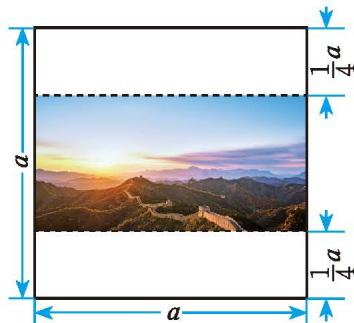

> [!info] 情境引入：操场面积问题
> 一个长方形操场被划分成四个不同的小长方形活动区域，各边的长度如图 1-2 所示。如何计算整个操场的面积？你是怎样想的？与同伴进行交流。
> 
> 

>   
>    
>   
图 1-2

> 

> 
> > [!success]- 小明认为可以先分别计算四个小活动区域的面积，再求整个操场的面积。你能求出 A，B，C，D 四个区域的面积吗？请解释你的运算过程。
> > 依据矩形面积公式可得：
> > * $S_A = a \cdot 3a = 3a^2$
> > * $S_B = a \cdot 2b = 2ab$
> > * （区域 C 和 D 的边长需结合具体图示比例或给定未知数进一步表示，此处重点在于通过各区域相加引出多项式乘法）。

你能计算 $abc \cdot b^{2}c$ ，$3x^{2}y \cdot 2xy^{3}$ ，$5a^{2}b^{2} \cdot (-2ab)$ 吗？  

> [!todo] 操作·交流
> 1. 一般地，如何进行单项式乘单项式的运算？与同伴进行交流。
> 
> > [!summary]- [单项式相乘法则](课本/【2024版】【北师大版】/【2024版】【北师大版】七年级下册数学/概念/单项式相乘法则.md)
> > **单项式与单项式相乘，把它们的系数、相同字母的幂分别相乘，其余字母连同它的指数不变，作为积的因式。**

> [!example]- 例 1
> 计算：  
> 2. $2xy^{2}\cdot \frac{1}{3} xy$  
> 3. $-2a^{2}b^{3}\cdot (-3a)$  
> 4. $7xy^{2}z\cdot (2xyz)^{2}$  
> 5. $(-3ab)\cdot \frac{1}{3} a^{2}c\cdot (-2abc^{3})$
> 
> > [!success]- 解
> > 1. $2xy^{2}\cdot\frac{1}{3}xy=\left(2\times\frac{1}{3}\right)\cdot(x\cdot x)\cdot(y^{2}\cdot y)=\frac{2}{3}x^{2}y^{3}$  
> > 2. $-2a^{2}b^{3}\cdot (-3a) = [(-2)\times (-3)]\cdot (a^{2}\cdot a)\cdot b^{3} = 6a^{3}b^{3}$  
> > 3. $7xy^{2}z\cdot (2xyz)^{2} = 7xy^{2}z\cdot 4x^{2}y^{2}z^{2} = (7\times 4)\cdot (x\cdot x^{2})\cdot (y^{2}\cdot y^{2})\cdot (z\cdot z^{2}) = 28x^{3}y^{4}z^{3}$  
> > 4. $(- 3 a b) \cdot \frac {1}{3} a ^ {2} c \cdot (- 2 a b c ^ {3}) = [ (- 3) \times \frac {1}{3} \times (- 2) ] \cdot (a\cdot a ^ {2}\cdot a) \cdot (b\cdot b) \cdot (c\cdot c ^ {3}) = 2 a ^ {4} b ^ {2} c ^ {4}$

> [!observe] 观察·思考
> 如图 1-3，一幅边长为 $a\text{ m}$ 的正方形风景画，上下各留有 $\frac{1}{4} a\text{ m}$ 的空白区域作装饰，中间画面的面积是多少平方米？
> 
> 

>   
>    
>   
图 1-3

> 

> 
> > [!success]- 解析
> > 中间画面的长为 $a\text{ m}$，宽为 $a - \frac{1}{4}a - \frac{1}{4}a = \frac{1}{2}a\text{ (m)}$。  
> > 面积为：$a \cdot \frac{1}{2}a = \frac{1}{2}a^2\text{ (m}^2\text{)}$。

---

> [!note] 随堂练习
> 6. 计算：  
>    (1) $5x^{3}\cdot2x^{2}y$  
>    (2) $-3ab \cdot (-4b^{2})$  
>    (3) $3ab \cdot 2a$  
>    (4) $yz \cdot 2y^{2}z^{2}$  
>    (5) $(2x^{2}y)^{3} \cdot (-4xy^{2})$  
>    (6) $\frac{1}{3} a^3 b \cdot 6a^5 b^2 c \cdot (-ac^2)^2$
> 
> > [!success]- 参考答案
> > (1) $10x^5y$  
> > (2) $12ab^3$  
> > (3) $6a^2b$  
> > (4) $2y^3z^3$  
> > (5) $8x^6y^3 \cdot (-4xy^2) = -32x^7y^5$  
> > (6) $\frac{1}{3} a^3 b \cdot 6a^5 b^2 c \cdot a^2c^4 = 2a^{10}b^3c^5$
