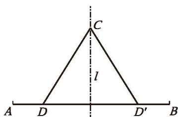
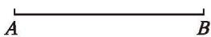
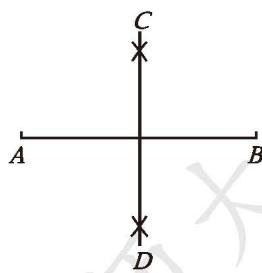
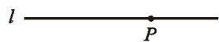
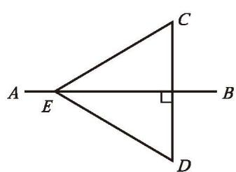

> [!info] 情景引入
> 线段（如图 5-12）是轴对称图形吗？如果是，请描述它的对称轴的特点。
> 
> 

>   
>    
>   
图 5-12

> 

> 
>> [!summary]- 答
>> 线段是轴对称图形，垂直并且平分线段的直线是它的一条对称轴。  

垂直于一条线段，并且平分这条线段的直线，叫作这条线段的[垂直平分线](课本/【2024版】【北师大版】/【2024版】【北师大版】七年级下册数学/概念/垂直平分线.md)（简称中垂线，perpendicular bisector）。

> [!question] 尝试·思考
> 如图 5-13，直线 $l$ 是线段 $AB$ 的垂直平分线，点 $C$ 是 $l$ 上的任意一点。在线段 $AB$ 上画出以直线 $l$ 为对称轴的一组对应点 $D$ 和 $D'$ ，连接 $CD$ 和 $CD'$ 。  
> (1) 你认为线段 $CD$ 和 $CD'$ 之间有什么关系？说说你的理由。  
> 
> 

>   
>    
>   
图 5-13

> 

> 
> (2) 特别地，当点 $D$ 与点 $A$ 重合时，点 $D'$ 位于什么位置？此时，线段 $CD$ 和 $CD'$ 之间还有 (1) 中的关系吗？由此你能得到什么结论？
> 
>> [!success]- [线段垂直平分线的性质](课本/【2024版】【北师大版】/【2024版】【北师大版】七年级下册数学/概念/线段垂直平分线的性质.md)
>> 线段垂直平分线上的点到这条线段两个端点的距离相等。

> [!question] 思考·交流
> 如图 5-14，已知线段 $AB$ ，如何作出它的垂直平分线？假设线段 $AB$ 的垂直平分线已作出，请回答下列问题：
> 
> 

>   
>    
>   
图 5-14

> 

> 
> (1) 这条直线有什么特征？  
> (2) 如何确定这条直线上的两个点？用三角尺、量角器、圆规等工具试一试。如果只用尺规呢？与同伴进行交流。
> 
>> [!success]- 提示
>> 需要确定的点是线段对称轴上的点，因此应当从线段两端进行"对称"的操作。

> [!example]- 例 2
> 如图 5-15，已知线段 $AB$ ，请用尺规作线段 $AB$ 的垂直平分线。  
> 
> 作法：  
> 1. 分别以点 $A$ 和点 $B$ 为圆心，以大于 $\frac{1}{2} AB$ 的长为半径作弧，两弧相交于点 $C$ 和 $D$ （如图 5-15）。  
> 
> 

>   
>    
>   
图 5-15

> 

> 
> 2. 作直线 $CD$ 。  
> 直线 $CD$ 就是线段 $AB$ 的垂直平分线。  
> 
> 请你说说这样作的道理。

[尺规作图 垂直平分线](课本/【2024版】【北师大版】/【2024版】【北师大版】七年级下册数学/知识点/尺规作图%20垂直平分线.md)

##### 操作·思考

如图 5-16，已知直线 $l$ 和 $l$ 上的一点 $P$ ，如何用尺规作 $l$ 的垂线，使 it 经过点 $P$ ？能说明你的作法的道理吗？

  
   
  
图 5-16

[尺规作图 垂线](课本/【2024版】【北师大版】/【2024版】【北师大版】七年级下册数学/知识点/尺规作图%20垂线.md)

---

##### 随堂练习

1. 如图，已知 $AB$ 是线段 $CD$ 的垂直平分线， $E$ 是 $AB$ 上的一点，如果 $EC = 7 \text{ cm}$ ，那么 $ED$ 的长是多少？  
2. 画一条线段 $PQ$ ，用尺规作线段 $PQ$ 的中点。

  
   
  
(第 1 题)

